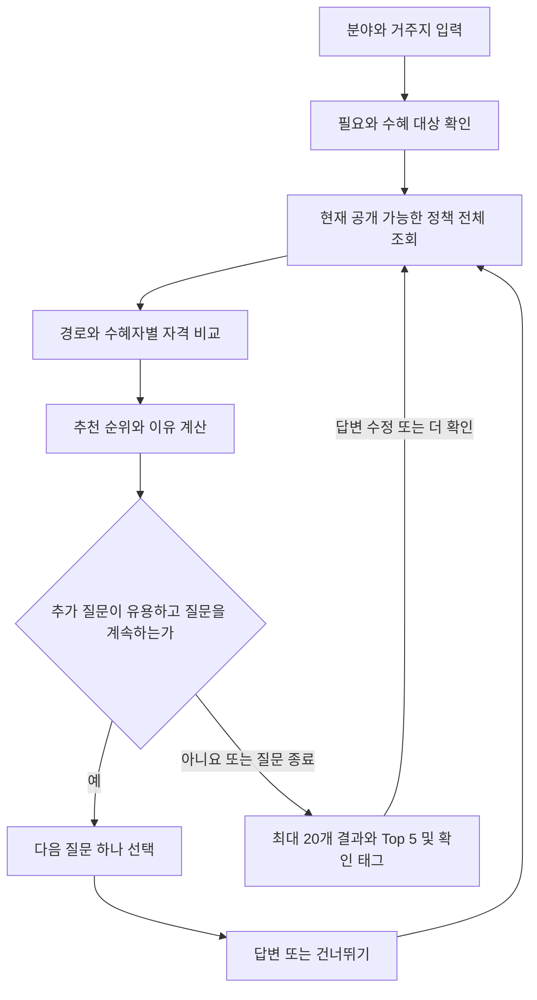

# 아키네이터 방식 정책 추천 알고리즘 구현 설계

작성일: 2026-09-09 · 버전: `adaptive-recommendation-v1-design` · 상태: 순수 엔진 1차 구현, 서버·UI·실제 공개 연결 미구현

구현 상태와 제한은 [엔진 실행 안내](./policy-recommendation-engine.md)를 참조한다. 아래 전체 설계 중 서버·공개 승인·커서와 다른 분야의 역할 확장은 아직 구현하지 않았다.

## 1. 목표와 설계 결정

사용자는 **분야 → 거주지 → 지금 필요한 지원 → 답변에 따라 달라지는 상세 질문 → 중간 추천 → 선택적 정밀화** 순서로 탐색한다. 한 정책을 맞히는 대화가 아니라 여러 적합한 정책을 찾는 과정이다. 질문을 모두 마칠 필요 없이 결과를 볼 수 있다.

정책의 공개·근거·수혜자·검수·자격 처리 원칙은 [정책 취급 기준](./policy-recommendation-policy-handling.md)이 기준이다. 본 문서는 그 원칙을 구현할 모듈·타입·질문 선택·정렬·API·검증을 정한다. 초기 [질문 대응표](./policy-recommendation-input-mapping.md)의 정렬 제안보다 본 문서의 구체적인 v1 결정이 우선하며, 현재 화면 동작은 [입력 UI 문서](../ui/interest-questions.md)를 따른다.

| 항목 | v1 결정 |
| --- | --- |
| 자격 | `ELIGIBLE / INELIGIBLE / UNKNOWN`. 공개 사용이 허용된 정책 중 자격 단계에서 제외하는 것은 `INELIGIBLE`뿐 |
| 정책 사용 | 현재 원문·분야·목적·수혜 경로에 대한 인간 공개 결정 필요. 유효한 인간 검수 규칙만 확정 비교에 사용. AI 검수 라벨만으로 공개·자격 충족을 확정하지 않음 |
| 질문 | 미리 검수한 질문·선택지·템플릿을 등록하고 정책 조건에 연결. 매 요청에서 다음 질문을 선택하며 모든 대화 분기를 사전 작성하지 않음 |
| 추천 순위 | 명시한 필요, 시점·생애 단계, 제공 방식, 확인된 마감 순의 설명 가능한 우선순위. v1은 0~100 가중합·확률 점수를 사용하지 않음 |
| 사용자 정보 | 브라우저 메모리의 답변을 서버로 보내 재평가. 로그인·프로필 영구 저장은 선행 조건이 아님. 기존 ‘서버 미전송’ 안내는 구현 시 반드시 변경 |
| 범위 | 교육 E03·E04의 근거를 보완한 검수 경로부터 시작. 한 분야 선택 유지. 다른 분야 자동 혼합·자격 규칙 자동 생성·자유문 대화·학습 모델은 v1 범위 밖 |

### 확정한 사용자 흐름

- 자녀 관련 정책은 세션에 등록한 자녀 중 **한 명 이상을 선택**해 함께 찾는다. 한 명 선택도 지원한다. 선택 목록은 탐색 범위이며 실제 총자녀 수·정책상 다자녀 산정 수와 다르다.
- 공통 가구 질문은 의미·대상·기준일이 같을 때 한 번만 묻는다. 학교·연령·장애 인정·입학 사건 등은 자녀 ID에 연결해 각각 평가한다. 특정 자녀의 사실을 형제자매에게 복사하지 않는다.
- 질문을 진행하는 동안 추천 카드를 표시하지 않는다. 질문을 마치거나 사용자가 질문 종료를 선택하면 최종 결과를 표시한다. 모름·건너뛰기는 계속 허용한다.
- 한 추천 결과는 고유 정책 **최대 20개**, 그중 앞의 **최대 5개를 Top 5로 강조**한다. 부족한 수는 억지로 채우지 않는다. 자녀별 20개가 아니며 같은 정책은 카드 하나다.
- 자녀별 `입력 기준 조건 일치`·`추가 확인 필요` 태그와 확인 사항을 표시한다. 가구 대상은 실제 가구 경로가 있을 때만 표시한다. 한 자녀가 일치해도 다른 자녀까지 일치로 표시하지 않는다.
- 세부 필요의 단일/복수 선택은 아직 확정하지 않았다. 결과 개수 결정으로 관심 선택 개수를 추정하지 않는다. 기존 복수 목적 평가 계약은 유지한다.



## 2. 현재 코드·데이터와 구현 간격

| 영역 | 확인한 현재 구현 | 새 설계에 필요한 연결 |
| --- | --- | --- |
| 공개 정책 | [PublicPolicy](../../src/features/policy/public/types.ts)는 제목·대상·선정기준·내용·기간 등의 표시 문자열과 URL을 제공 | 표시 객체와 별도로 서버의 공개 가능 라벨·목적·수혜 경로·검수 규칙·시점 정보 필요 |
| 서버 조회 | [public-data.ts](../../src/features/policy/public-data.ts)는 활성 후보의 정제 표시값을 최대 1,000행씩 읽음. 공개 승인·조건 비교의 대체가 아님 | `readRecommendationCatalog`가 공개 기준을 통과한 전체 선택 분야의 일관된 버전 묶음을 읽어야 함 |
| 공개 API | [GET /api/policies](../../src/app/api/policies/route.ts)는 `offset`만 받고 공개 캐시 헤더를 사용 | 개인화 답변은 별도 POST API 사용. 공개 캐시에 개인정보·추천 응답을 넣지 않음 |
| 탐색 화면 | [PolicyFinder](../../src/features/policy/components/PolicyFinder.tsx), [PolicyMatch](../../src/features/policy/components/PolicyMatch.tsx)는 불러온 목록에서 키워드 분야 필터와 페이지 처리 | 맞춤 추천 경로는 서버의 전체 대상 필터·집계·순위·페이지 응답으로 전환 |
| 사용자 입력 | `PolicyConditions`에 분야·주민등록 지역·자녀·소득·가구·분야별 필요가 있음. 상태는 문자열·빈 배열·`unknown` 혼재 | 사실의 대상·산정 기준·시점·정밀도·응답 상태를 갖는 정규화 계약과 기존 입력 어댑터 필요 |
| 교육 실표본 | [20건 분석](./policy-education-mapping-audit-20260909.md): 30개 경로의 설계 후보, 정확 인용 114개 확인. 모두 조건 불완전 | 이 기록은 실행 규칙·인간 검수·현재 공식 정보가 아님. E03·E04부터 근거·예외를 보완해 구현용 fixture를 별도로 준비 |

`criteria_text`가 비어 있어도 `target_text`·`benefit_text`에 조건 근거가 있으면 검수 후보를 만들 수 있다. 반대로 문자열이 있다는 이유만으로 비교 가능한 규칙이라 보지 않는다. `updated_at`은 정책 신청 가능 시각이나 공식 갱신일로 사용하지 않는다.

## 3. Feature와 제약의 구분

**Hard Constraint**는 검수된 필수 조건·제외·예외다. **Soft Constraint**는 선호로, 불일치해도 후보를 남기는 Ranking Feature의 한 종류다. 정보가 부족한 Hard Constraint를 Soft로 바꾸지 않고 `UNKNOWN`으로 둔다. 한 필드도 정책에서의 역할에 따라 다른 용도로 쓰인다.

| 정보 | 현재 사용자 값 | 필요한 정책 값·공백 | 분류·사용 |
| --- | --- | --- | --- |
| 분야 | `interests` 하나 | 현재 공개 가능 분야 라벨. 공개 응답에는 아직 없음 | 검색 범위. 자격 점수나 수혜 확정과 별개 |
| 세부 필요 | 돌봄·의료·생활 일부, 교육 등 보완 필요 | 실제 제공 목적·경로. 기존 교육 유형 두 개만으로 교복/통학 구별 부족 | 가장 우선하는 Ranking Feature |
| 주민등록 지역 | `region`, `district` | 정책의 적용 인물·지역 계층·주민등록/실거주·기준일 | 명시한 필수 지역이면 Hard. 제공기관 위치로 대체 금지. 지역 정책이라는 이유만으로 전국 정책보다 가점 없음 |
| 이용 지역·방식 | 돌봄 유형 등 일부 | 제공 장소·방식·시간의 유효한 근거 | 희망 접근성은 Soft/Ranking. 학교 소재지 같은 필수 요건은 별도 Hard |
| 생애 단계 | `family`, `birthTiming`, 자녀 출생 정보·이용 상태 | 대상 사건과 지원을 준비·이용하는 시점, 실제 자격 기간 | 일반 시기 관련성은 Ranking. 검수된 임신/출산 후 기간·연령 제한은 Hard도 가능 |
| 자녀 연령 | `children[].birth/precision` | 대상 자녀·단위·경계·기준일 | Hard 또는 생애 단계 Ranking. 나이에서 학교급·학년·재학 추정 금지 |
| 학교급·입학 | `care=school`만으로 부족 | 학교급·학년·기관 유형·입학 사건·연도·학교 소재지 | 명시 요건은 Hard, 입학 준비의 필요는 Ranking. ED02~ED04 추가 필요 |
| 가구·복지 인정 | `household`, `welfare` | 정확한 인정 종류·대상·시점과 대체 경로 | 검수된 조건이면 Hard. 해당 특성 자체에 일반 가산점을 부여하지 않음 |
| 소득 | 기준 중위소득 구간만 있음 | 산정 기준·연도·가구 정의·경계 | Hard. 미입력은 UNKNOWN. 낮은 소득에 일괄 가점, 월급 비율 환산 없음 |
| 자녀 수·순위 | `totalChildren`, `childrenComplete`, 목록 | 정책별 자녀 범위·출생순위·같은 자녀 결합 | Hard. 목록 길이로 총수·순위를 만들지 않음 |
| 신청·이용 기간 | 희망 시점 추가 필요 | 신청 기간·급여 기간·실제 이용 시점·확인 시각을 분리 | 접수 상태는 결과 분류, 마감 임박은 제한된 Ranking. 미확인 접수는 자격 탈락 아님 |
| 혜택 규모·중요도 | 별도 값 없음 | 금액·주기·대상·상한·현물·서비스·융자 등 서로 다른 형태 | v1 표시·설명만. 단순 최대금액 가점이나 임의 중요도 없음 |

## 4. 핵심 타입과 불변 조건

아래 TypeScript는 제안 인터페이스다. 현재 저장 컬럼이나 완성된 라이브러리가 아니며, 실제 구현 시 런타임 검증·직렬화 규격을 함께 작성한다. 문자열 ID는 등록된 사전·서버에서 발행한 범위와 대조한다.

```ts
type Eligibility = "ELIGIBLE" | "INELIGIBLE" | "UNKNOWN";
type Truth = "TRUE" | "FALSE" | "UNKNOWN";
type SubjectRef = {
  kind: "SELF" | "CHILD" | "PARENT" | "HOUSEHOLD";
  id: string; // 세션 내 식별자. 서로 다른 자녀를 결합하지 않는다.
};
type FactKey = {
  attribute: string;          // 예: education.schoolRegion
  subject: SubjectRef;
  basis: string;              // 주민등록/실거주, 소득 산정 방식 등
  reference: string;          // 현재/2026-03-01/특정 입학 사건 등
};
type FactValue =
  | { kind: "BOOLEAN"; value: boolean }
  | { kind: "CODE"; value: string }
  | { kind: "NUMBER_RANGE"; min: number | null; max: number | null;
      minInclusive: boolean; maxInclusive: boolean; unit: string }
  | { kind: "DATE_RANGE"; earliest: string; latest: string;
      precision: "DAY" | "MONTH" | "RANGE" };
type Answer = { key: FactKey; recordedAt: string } & (
  | { state: "PROVIDED"; value: FactValue; source: "USER_DECLARED" }
  | { state: "EXPLICIT_NOT_APPLICABLE" }
  | { state: "DONT_KNOW" | "SKIPPED" | "UNASKED" | "LEGACY_UNSPECIFIED" }
);
type UnknownCause = {
  kind: "USER_MISSING" | "USER_PRECISION" | "USER_CONFLICT"
      | "POLICY_MISSING" | "POLICY_CONFLICT" | "UNREVIEWED_RULE"
      | "STALE_RULE" | "INCOMPLETE_PATHS" | "INCOMPLETE_SUBJECTS";
  ruleId?: string;
  factKey?: FactKey;
  resolvableByQuestion: boolean;
};
type Evaluation<T> = {
  value: T;
  reasonCodes: string[];
  evidenceRefs: string[];
  usedAnswerKeys: FactKey[];
  unknowns: UnknownCause[];
};
type RuleExpression =
  | { kind: "PREDICATE"; ruleId: string }
  | { kind: "ALL" | "ANY"; children: RuleExpression[] }
  | { kind: "NOT"; child: RuleExpression }
  | { kind: "UNRESOLVED"; reason: string };
type ContextVersion = {
  releaseRevision: string; ruleVersion: string; purposeVersion: string;
  taxonomyVersion: string; questionVersion: string; rankingVersion: string;
};
type EvaluationContext = {
  versions: ContextVersion;
  evaluatedAt: string; // 서버 시각을 고정해 모든 비교에 공유
  timezone: "Asia/Seoul";
};
type PathEligibility = {
  policyId: string; pathId: string;
  binding: Record<string, SubjectRef>;
  result: Evaluation<Eligibility>;
};
```

`evaluatedAt`은 서버 시각을 고정해 한 번의 평가에서 공유한다. `reference`가 사건을 가리키면 별도의 사건 사전에 대상 인물·사건 종류·답변 날짜를 연결한다. 미래 출산·입학이 발생했다고 임의 생성하지 않는다.

각 `ruleId`는 서버의 규칙 등록부에서 다음을 가져온다: 속성·대상 역할, 비교 연산자(`EQ`, `IN_SET`, `RANGE`, `RESIDES_IN` 등 허용 목록), 타입이 맞는 값·단위·경계·기준일, 원문 근거, 인간 검수 및 현재 유효성, 적용 경로. 분류 코드에서 조건을 즉석 생성하거나 서버에서 임의 코드를 실행하는 표현식을 허용하지 않는다.

`RuleExpression`은 **같은 경로·수혜자 바인딩의 최종 자격식**이다. `기본 조건 AND NOT(제외 AND NOT(예외))`처럼 원문의 관계를 검수해 기록한다. 해결되지 않은 예외는 `UNRESOLVED`로 남긴다. 원문의 빠진 분기를 빈 `ANY`·`ALL`로 만들어 자동 참·거짓 처리하지 않는다. 명시적 제한 없음은 근거를 가진 별도 참 조건으로 등록한다.

지원 경로에는 자격식 외에 `scopeCompleteness`, `alternativeCoverage`, 수혜자 역할·관계·집계 범위, 목적, 제공 내용·시점, 공개 결정의 유효성 참조를 둔다. 세부 기준은 정책 취급 문서가 정의한다. 지급액·횟수 분기는 자격식과 별도로 평가한다.

### 기존 답변 변환

- `region/district`는 사용자가 답한 주민등록 지역으로만 변환한다. 지역 코드 사전·계층과 연결하며 과거 기준일 거주 사실로 재사용하지 않는다.
- `children[].id`를 세션 내 자녀 ID로 유지한다. 출생월은 가능한 날짜 구간으로 표현하고, 날짜 하나로 채우지 않는다. 전체 목록 여부와 실제 총수는 별도 사실이다.
- `income` 구간의 양끝 포함 여부를 보존한다. 기준 연도·가구 정의가 없으면 조건 비교의 해당 부분은 UNKNOWN이다.
- 일반 한부모·가구 내 장애와 특정 인정·해당 자녀 장애를 분리한다. 복수 선택에서 선택하지 않은 항목은 false가 아니다. 명시적 ‘해당 없음’도 제시한 질문 범위의 응답일 뿐 모든 법정 인정의 부정이 아니다.
- 기존 `unknown`이나 빈 값은 `LEGACY_UNSPECIFIED`로 옮겨 모름·건너뛰기·미질문을 추정하지 않는다. 새 흐름은 각각 구분한다.
- 현재 분야 변경의 공통값 보존·분야 전용값 초기화 의미를 유지한다. 부모 답변 변경으로 더 이상 적용되지 않는 종속 사실은 비활성화해 계산에서 제외한다. 숨겨진 답변은 자동 비교에 넣지 않는다.

## 5. 자격 평가 알고리즘

기존 문서의 `MATCH / NO_MATCH / NEEDS_CHECK`는 API의 `ELIGIBLE / INELIGIBLE / UNKNOWN`에 각각 대응한다. 화면에서는 ‘입력 정보 기준 조건 일치 / 조건 불일치 / 추가 확인 필요’로 설명한다.

### 원자 조건과 AND/OR

| 비교 상황 | 결과 |
| --- | --- |
| 현재 유효한 검수 규칙, 같은 대상·기준의 충분한 답변 | 해당 비교의 TRUE 또는 FALSE |
| 사용자 값 누락·정밀도 부족·상충 또는 규칙 미검수·무효·충돌 | UNKNOWN과 해결 주체·사유 |
| AND | FALSE가 있으면 FALSE, 모두 TRUE면 TRUE, 나머지 UNKNOWN |
| OR | TRUE가 있으면 TRUE, 모두 FALSE면 FALSE, 나머지 UNKNOWN |
| NOT | TRUE↔FALSE, UNKNOWN은 UNKNOWN |

부분 원문에 FALSE 하나가 있다고 정책 전체를 제외하지 않는다. 위 표는 **검수된 적용 범위의 식 내부 계산**이고, 아래 완전성 검사를 통과해야 최종 자격 상태가 된다. 예외가 빠져 필수라는 사실 자체를 확인 못 하면 해당 조건은 확정 FALSE로 쓸 수 없다.

1. 각 정책에서 현재 공개 가능한 관련 경로를 식별하고, 수혜자·부모·가구·사건 역할을 일관되게 바인딩한다. 두 자녀의 조건을 섞지 않는다.
2. 규칙의 버전·검수·근거 유효성을 검사한 뒤 식을 평가한다. 필요한 사용자 사실을 `unknowns`로 수집하고, 정책 재검토 사유는 별도로 남긴다.
3. 한 경로의 필수 조건·예외·범위가 완전하며 식이 TRUE일 때만 그 경로가 ELIGIBLE이다. 미확인 필수 범위가 남으면 UNKNOWN이다.
4. 경로의 FALSE는 검수된 필수조건과 해결된 예외에 근거해야 한다. 전체 정책의 INELIGIBLE은 관련 대체 경로·수혜 대상이 빠짐없이 확인되고 모두 불일치할 때만 허용한다. 미검수/미공개 대체 경로의 존재는 공개 내용을 노출하지 않고 배제 판단의 불완전성으로 남긴다.
5. 적어도 하나의 완전한 경로·수혜자 조합이 ELIGIBLE이면 정책 카드는 해당 범위를 표시할 수 있다. 다른 경로·급여까지 모두 충족한다고 설명하지 않는다. 어느 경로도 확정 일치하지 않고 전체 제외 근거가 부족하면 UNKNOWN이다.
6. 명시적으로 선택한 자녀 범위가 완전하면 그 범위의 경로를 모두 확인해 제외를 판단할 수 있다. 다만 선택하지 않은 자녀를 포함한 가족 전체가 불일치한다고 설명하지 않는다. 수혜 자녀 미지정·평가 대상 목록 불완전 상태에서 입력된 자녀가 모두 실패했다고 전체 정책을 제외하지 않는다. 사용자 정보가 상충하면 정정 가능한 질문을 제시하되 어느 값을 임의 선택하지 않는다.

수치·날짜 구간은 가능한 모든 값이 조건을 만족할 때 TRUE, 모두 불일치할 때 FALSE, 경계를 걸치면 UNKNOWN이다. 이 연산은 산정 기준·대상·기준일이 일치할 때만 가능하다. E01의 50% 기준과 ‘80% 이하’ 응답은 UNKNOWN이다. E12의 부모 또는 모 중 한 명·자녀 거주 조건은 해당 입학 사건의 역할별 사실을 함께 평가한다.

## 6. 추천 순위와 결과 구성

### 결과 집합과 시점

자격 INELIGIBLE은 기본 추천에서 제외하되 공개 가능한 범위의 사유를 남긴다. 접수 `CLOSED`는 별도의 마감된 정보로 분리한다. `OPEN`·접수 `UNKNOWN`은 지금 찾는 후보에 남기고 확인 여부를 표시한다. 확인된 향후 신청 일정은 ‘예정된 지원’으로 구분한다. 신청 시작 전은 표시용 가용성 `SCHEDULED`로 표현하며 현재 접수 중이라 표시하지 않는다. 원본 계약의 접수 상태 세 가지와 향후 일정의 시점 구분은 별도 보존한다.

결과 보기는 `CURRENT / UPCOMING / CLOSED`로 나누고 CURRENT를 기본으로 한다. 먼저 경로를 해당 보기에 배치한 뒤 그 보기 안에서 정책당 한 카드를 만든다. 같은 정책의 다른 경로가 다른 보기에 있을 수 있으며 보기별 건수를 합산해 전체 고유 정책 수라 표시하지 않는다. 접수 UNKNOWN은 CURRENT에서 ‘접수 확인 필요’로 표시한다.

예정된 지원도 현재 답변과 정책이 명시한 기준일로만 비교한다. 단순히 미래에 나이가 늘거나 출산·입학할 것으로 예상해 현재 INELIGIBLE 정책을 ‘앞으로 자격 충족’으로 바꾸지 않는다. 미래 신청 시점·사건이 확정되지 않으면 해당 비교는 UNKNOWN이다. 사용자가 명시한 향후 필요를 찾아볼 수는 있지만 자격 예측과 구분한다.

### v1 정렬 규칙

가중치 근거가 없는 86점 같은 종합 수치는 제공하지 않는다. `calculatePolicyScore`는 비교 가능한 **순서 키와 구성 근거**를 반환한다. 같은 요청·답변·평가 시각·버전에서는 결과 순서가 같아야 한다.

```ts
type Fit = "MATCH" | "UNKNOWN" | "OTHER" | "NOT_USED";
type FeatureName = "need" | "timing" | "lifeStage" | "delivery" | "urgency";
type FeatureEvaluation = Evaluation<Fit> & {
  feature: FeatureName;
  orderValue: number | null; // 확인된 마감 시각 등 내부 정렬값
};
type RankScore = {
  strategy: "LEXICOGRAPHIC_V1";
  features: FeatureEvaluation[];
  key: number[]; // 오름차순 내부 순서 키. 확률·적격도 백분율이 아님
  numericScore: null;
};
type Recommendation = {
  policyId: string;
  pathIds: string[];
  representativePathId: string;
  representativeSubjects: SubjectRef[];
  eligibility: Eligibility;
  eligibilityScope: { pathId: string; subjects: SubjectRef[] }[];
  availability: "OPEN" | "SCHEDULED" | "CLOSED" | "UNKNOWN";
  pathResults: {
    pathId: string; subjects: SubjectRef[];
    eligibility: Eligibility;
    availability: "OPEN" | "SCHEDULED" | "CLOSED" | "UNKNOWN";
  }[];
  score: RankScore;
  reasons: { code: string; text: string; publicEvidenceRefs: string[] }[];
  checksNeeded: { code: string; text: string; questionKey?: string }[];
};
```

기본 그룹 안에서 다음 키를 사전식으로 비교한다.

1. **직접 선택한 필요의 일치**: MATCH → UNKNOWN → OTHER.
2. **사용자가 필요한 시점과 정책의 이용 시점 일치**: 같은 순서. 마감일로 지급·이용 시점을 대신하지 않는다.
3. **생애 단계 관련성**: 같은 순서. 검수된 목적·시점 근거에 연결된 규칙으로만 비교하며 모든 정책에 연령 점수를 중복 가산하지 않는다.
4. **선호한 제공 방식의 일치**: 방문/온라인·시간 등 정책이 실제 제공하는 근거와 비교한다. 같은 순서.
5. **확인된 신청 마감**: 위 1~4가 같은 정책 사이에서, 현재 접수 중이고 유효한 마감일이 있는 것은 빠른 마감 순. 나머지는 같은 마감 우선순위를 가진다. 예정 그룹은 현재 접수 마감의 시급성을 적용하지 않고 확인된 시작일을 안내한다.
6. **안정적인 정책 ID**: 동률의 마지막 기준. 표시용 제목·변동하는 조회 순서에 의존하지 않는다.

구현상 MATCH=0, UNKNOWN=1, OTHER=2로 순서를 표현한다. 이는 미확인에 감점을 부여하는 수치 모델이 아니라 **근거 있는 일치 / 확인 필요 / 다른 필요**라는 표시 그룹이다. 알려진 불일치와 미확인을 합치지 않는다. 사용자 선호를 건너뛴 feature는 모든 후보에 NOT_USED로 두고 키에서 생략한다. 일부 정책에만 해당 근거가 없으면 UNKNOWN으로 남긴다. 일부 feature만 있는 정책의 점수를 별도 분모로 정규화해 과대평가하지 않는다.

자격 UNKNOWN에는 일괄 감점이나 뒤쪽 격리 규칙을 두지 않는다. 알려진 필요가 맞으면 상위에 남을 수 있으며 카드에 추가 확인 사유를 표시한다. 지역·가구·소득은 필수조건 비교 결과와 설명으로 활용하고, 지역 정책·특정 가구에 기본 가산점을 주지 않는다. 마감 임박이 더 중요한 필요를 앞지르지 못한다.

### 중복과 다양성

각 결과 보기에서 경로별로 비교·순위를 계산한 다음 가장 적합한 **실제 한 경로·수혜자 조합**을 카드의 대표 이유로 택하고, 다른 관련 경로는 같은 카드에 표시한다. 경로 동률은 `pathId`, 다음은 정렬된 역할·수혜자 ID의 직렬화 값으로 결정한다. 복수 목적이면 선택한 필요와 일치하는 코드 중 사전 코드순 첫 값을, 일치가 없으면 해당 경로의 검수된 목적 코드순 첫 값을 대표 목적으로 사용한다.

카드 최상위 `eligibility`, `availability`, `score`, `reasons`는 모두 **대표 경로와 같은 수혜자 조합**의 값이다. 다른 경로의 높은 점수 요소·유리한 조건·OPEN·ELIGIBLE 배지를 결합하지 않는다. 다른 경로는 `pathResults`와 해당 범위의 별도 설명으로 보여준다. 경로 집계상의 ‘어떤 지원 하나는 조건 일치’와 대표 지원의 상태를 혼동하지 않는다. 마감된 교복 경로와 OPEN인 방문학습 경로가 있다면 CURRENT 카드에서는 학습 경로를 대상으로 평가하고 교복 지원을 현재 이용 가능한 추천 이유로 쓰지 않는다.

정책별 중복 제거와 정렬을 전체 대상에 적용한 후 추천 목록을 최대 20개로 자른다. 현재 선택한 결과 보기의 후보 전체 수와 실제 추천 수를 구분한다. 페이지 이동으로 20개 상한을 넘지 않으며 Top 5는 페이지마다 다시 선정하지 않는다.

v1은 한 분야 안에서 위 1~5 키가 모두 같은 정책에 한해 6번 정책 ID 순서에 앞서 자녀별 대표성과 세부 목적 다양성을 조정한다. 동률 묶음에서는 앞서 선택된 카드에서 덜 다뤄진 선택 자녀의 경로를 포함한 정책을 먼저 선택하고, 그래도 동률이면 세부 목적별로 순환 배치한다. 자녀별 집계에는 실제 ELIGIBLE 또는 UNKNOWN인 공개 경로만 사용하고 상태 태그는 구분한다. 한 카드가 여러 자녀에게 관련되면 각 자녀의 표시 횟수를 한 번씩 증가시킨다. 가구 경로만 있는 카드를 임의로 모든 자녀의 카드로 세지 않는다. 더 적합한 정책을 밀어내거나 자녀별 할당량을 강제하지 않으며, 관련 후보가 없는 자녀를 채우기 위해 불일치 정책을 올리지 않는다. 기본값은 이 동률 다양성 처리를 켠다. 목적 그룹 순서는 등록된 목적 코드, 그룹 내부는 정책 ID 순이며 전체 목록에서 한 번 실행한 뒤 페이지를 자른다. 복수 목적 정책은 대표 경로의 목적 하나에만 배치한다. 사용자가 선택하지 않은 다른 상위 분야를 결과에 섞지 않는다.

후속 점수화·다양성 강도 변경은 별도 평가 표본과 사용자 사용성 결과로 결정하고 `rankingVersion`을 올린다. 혜택 규모나 불명확한 ‘정책 중요도’를 임의 가중치로 넣지 않는다.

### Feature별 계산 계약

| 계산 | MATCH / OTHER / UNKNOWN 결정 |
| --- | --- |
| 필요 | 사용자가 선택한 목적 코드가 해당 경로의 검수된 목적에 포함되면 MATCH, 완전한 목적 범위에 없으면 OTHER, 목적 매핑이 불완전하면 UNKNOWN |
| 시점 | 명시한 이용 희망 구간과 실제 제공 가능 구간의 이용 가능성이 확인되면 MATCH, 두 구간이 명확히 분리되면 OTHER, 단순 신청일만 있거나 제공 시점이 불명확하면 UNKNOWN |
| 생애 단계 | 인간 검수된 해당 경로의 관련성 식에 임신/출산 사건·해당 자녀 사실을 대입한다. TRUE→MATCH, FALSE→OTHER, 미확인→UNKNOWN. 자격식과 별도이며 같은 역할·기준일 원칙을 적용 |
| 방식 | 사용자가 선택한 시간·온라인/방문 등 활성 선호를 해당 경로의 제공 속성과 비교. 모두 일치하면 MATCH, 확인된 불일치가 있으면 OTHER, 나머지는 UNKNOWN |
| 마감 | CURRENT 보기에서 OPEN이며 유효한 미래 마감이 확인된 경우만 우선 그룹과 `orderValue`에 마감 시각을 반환. 그 외는 같은 비우선 그룹으로 정렬. UNKNOWN을 마감 완료로 만들지 않음 |

생애 단계 관련성 식은 ‘임신 30주면 가점’ 같은 임의 수치가 아니라 정책의 지원 목적·권장 이용 시점 근거를 가진 별도 등록 항목이다. 관련성 근거가 없으면 해당 feature를 확정 계산하지 않는다. 필요·시점·방식에 사용자 의사가 없으면 NOT_USED이며, 생애 단계도 해당 사실을 답하지 않았으면 모든 후보에서 그 feature를 생략한다. 불확실한 출생일·이용 시점의 가능한 범위를 단 하나의 날짜로 확정해 MATCH를 만들지 않는다.

## 7. 질문 등록부와 템플릿

질문은 정책마다 복사하지 않는다. `속성 + 대상 + 산정 기준 + 기준 시점`의 의미가 같은 질문을 묶고 `requiredBy`에 필요한 정책·경로·규칙을 연결한다. 같은 지역 질문도 ‘현재 주민등록’과 ‘2026년 3월 1일 주민등록’은 다르다.

```ts
type QuestionDefinition = {
  id: string; version: string;
  template: string;
  answerType: "CHOICE" | "BOOLEAN" | "DATE" | "NUMBER_RANGE" | "REGION";
  options: { code: string; label: string }[];
  attribute: string;
  prerequisites: string[];
  burden: 1 | 2 | 3 | 4;
  allowedPurposes: ("ELIGIBILITY" | "RANKING")[];
};
type QuestionInstance = {
  key: string; // 의미 있는 FactKey와 질문 버전에서 생성
  definitionId: string;
  factKey: FactKey;
  params: Record<string, string>; // 검수된 날짜·지역·단위만 허용
  requiredBy: { policyId: string; pathId: string; ruleId?: string }[];
  prompt: string;
  whyAsked: string;
};
```

예: `“{기준일}에 {지역}에 주민등록이 되어 있었나요?”`. 날짜·지역은 검수된 규칙에서 가져오며 임의 원문 전체를 템플릿에 삽입하지 않는다. 사용자에게 보여주는 질문·이유는 공개 가능한 근거만 포함한다. ‘아니요’, ‘해당 없음’, ‘모름’, ‘건너뛰기’는 다른 응답이며 질문별 의미를 등록한다.

정책마다 새 질문을 생성할 필요는 없다. 새 조건 유형은 속성·연산자·단위·답변 구조를 검토해 질문 등록부를 확장한다. 기존 타입으로 표현할 수 없으면 정책 검토 과제로 남기고 런타임 LLM이 즉석 질문·조건을 생성하지 않는다.

초기 등록 범위는 공통 C01~C10·A01~A06 중 실제 검수 후보가 요구하는 것과 교육 ED01~ED07이다. 진단명·상세 주소·증빙 파일은 수집하지 않는다. 예를 들어 통학 거리 조건은 ‘정책의 직선거리 기준을 넘는지 알고 있나요?’로 확인하고 미확인 상태를 허용한다.

## 8. 다음 질문 선택 알고리즘

### 질문 후보 생성

1. 분야는 하나 필수로 선택한다. 거주지는 선택 입력이다. 분야·거주지 이후 세부 필요와 수혜 대상 확인 기회를 제공한다. 자녀 관련 탐색에서는 한 명 이상을 선택한다. 필요·지역을 건너뛰어도 미확인으로 보존하고 유용한 추가 질문을 진행한다. 추천 카드는 질문 종료 후 표시한다. 이 기본 흐름도 이미 답한 값을 재질문하지 않는다.
2. 현재 공개 가능한 관련 후보의 평가에서 **답변으로 해결할 수 있는** `USER_MISSING`, `USER_PRECISION`, `USER_CONFLICT` 및 미확인 선호만 수집한다. 정책 자체가 미검수·모호한 조건은 질문 후보에서 제외한다.
3. 필요한 질문의 선행조건을 확인하고 같은 의미는 병합한다. 예를 들어 학교 소재지보다 수혜 자녀·재학 경로를 먼저 식별한다. 선행 질문은 뒤의 유용한 질문을 열 수 있을 때 후보로 포함한다.
4. 현재 사용자 선택 분야·수혜 경로와 무관한 질문과 현재 비교에 충분히 답한 질문을 제외한다. PROVIDED여도 정밀도가 부족하거나 다른 답변과 충돌하면 이유를 명시한 정밀화·정정 인스턴스를 허용한다. 원래 구간 응답은 보존하고 더 정확한 답변이 제출되면 같은 의미의 활성 사실을 대체한다. 건너뛴 질문과 ‘모름’은 자동 반복하지 않으며, 문구·정밀도만 바꿔 우회하지 않는다. 사용자가 ‘수정/더 확인’에서 직접 다시 열 수 있다.
5. 각 질문의 가능한 유효 답변을 대입해 조건 결과 또는 순위 근거가 달라지는지 평가한다. 모든 유효 답변에서 영향이 없거나 계속 정책 원문 부족만 남는 질문은 하지 않는다.

### 선택 함수의 구체적인 v1 기준

실제 응답 분포가 없으므로 정보이득·엔트로피를 추정했다고 주장하지 않는다. 질문마다 다음의 결정적 효용 대용치를 계산한다.

- `focusPolicies`: 전체 후보 중 직접 필요 MATCH 그룹이 있으면 그 그룹, 없으면 UNKNOWN 그룹, 그것도 없으면 나머지 후보. 후보를 결과에서 제거하는 규칙이 아니라 질문의 현재 우선순위만 정하는 기준이다. 후보가 질문에 따라 어느 그룹으로 이동할지도 함께 평가한다.
- `affected(q)`: 질문의 유효 답변을 바꿨을 때 **검수된 조건의 참/거짓/미확인, 경로 자격, 또는 순위 feature의 근거 상태**가 달라지는 focus 정책의 고유 개수. 같은 정책의 여러 규칙은 한 번만 센다. 마감일·정책 오류처럼 사용자 답변으로 바뀌지 않는 값은 제외한다.
- `cost(q)`: 등록부의 부담 단계. 1=간단한 선택, 2=날짜·구간 확인, 3=복수 인물·이력 확인, 4=소득·인정 정보 확인. 개인정보를 알아야 한다는 이유로 강제하지 않는다. 값은 초기 사용성 가설이며 정확도 점수가 아니다.
- `utility(q) = affected(q) / cost(q)`. 양수 중 최댓값, 동률이면 더 많은 정책의 자격 UNKNOWN을 실제로 해소할 수 있는 질문, 다음은 낮은 부담, 마지막은 질문 키 순으로 선택한다.

focus에 유효한 질문이 없으면 나머지 후보에 같은 계산을 한 번 적용한다. 그래도 효용이 없으면 질문을 종료한다. 당장의 판정이 바뀌지 않아도 검수된 필수조건의 미확인이 해소되어 후속 비교를 가능하게 하는 질문은 영향에 포함한다. 정책 원문을 고쳐야만 의미가 생기는 질문은 제외한다.

선행 질문의 효용은 그 질문이 열 수 있는 후속 질문들의 영향 정책 합집합으로 계산하고 비용에는 선행 질문과 가장 저렴한 후속 경로의 부담을 포함한다. 선행관계 그래프는 순환을 금지한다. 모름·건너뛰기를 가상의 긍정·부정 답변으로 세어 효용을 부풀리지 않는다.

날짜·숫자 입력은 가능한 모든 값을 열거하지 않고 **유효한 규칙 경계가 만드는 동치 구간**별로 시뮬레이션한다. 지역도 해당 규칙의 지역 집합/바깥/미확인 관계를 사용한다. 거짓으로 판단하기 위한 기준이 검수되지 않았으면 해당 분할을 만들지 않는다. 이는 추천 선택용 시뮬레이션이며 사용자 답변으로 저장하거나 실제 추천 결과에 섞지 않는다.

### 중단·수정·복구

- 한 번의 자동 질문 묶음은 기본 5개로 제한한다. 묶음 종료 시 추천 카드 대신 질문 계속/질문 마치기를 제공하며, 유용한 질문이 없거나 질문 마치기를 선택하면 최종 결과로 이동한다. 결과 화면에서 ‘답변 수정’ 또는 ‘더 정확히 찾기’로 질문을 다시 시작할 수 있다. 이는 사용성 기본값이며 정책 정보가 충분하다는 선언이 아니다.
- 사용자는 언제든 질문 마치기·뒤로·수정·모름·건너뛰기를 선택할 수 있다. 답변을 바꾸면 **원래 공개 가능한 전체 후보 집합**에서 재평가한다. 이전 제외 목록에서만 갱신하면 정책이 복구되지 않으므로 금지한다.
- 분야·수혜자·기준 사건 변경은 종속 답변·질문 효용·추천 커서를 무효화한다. 동일 의미로 남는 공통 답변만 재사용한다. 같은 키의 건너뛰기 표시는 명시적 재개 전까지 유지한다.
- 질문 없음은 모두 자격 충족이라는 뜻이 아니다. 정책 확인만 남음, 사용자 건너뜀, 질문 종료, 사용자 마치기 선택 등 종료 사유를 기록해 설명한다.
- 후보가 없으면 분야별 검수 범위와 조건 수정 경로를 안내한다. 키워드로 몰래 확대하거나 다른 분야로 자동 전환하지 않는다. 공개 불가 정책의 상세나 내부 검수자 정보는 노출하지 않는다.

## 9. 모듈과 일관된 함수 계약

다음 경로는 새로 만들 파일 제안이며 현재 파일 링크가 아니다. 도메인 계산은 `src/features/policy/recommendation/`의 순수 함수로, 서버 조회·HTTP는 별도 어댑터로 둔다.

| 제안 모듈 | 책임·핵심 함수 | 입력 → 출력 |
| --- | --- | --- |
| `types.ts`, `facts.ts` | `normalizeAnswers`, 기존 입력 어댑터·정밀도·대상·활성 범위 | 현재/새 응답 → 검증된 답변 집합과 오류 |
| `publication.ts` | `selectUsablePaths` | 현재 버전의 정책 묶음 → 공개 사용 가능 경로와 내부 보류 사유 |
| `eligibility.ts` | `evaluatePredicate`, `evaluateExpression`, `evaluateEligibility` | 검수 규칙·답변·평가 문맥 → `Evaluation<Truth>` / 경로별 `Evaluation<Eligibility>` |
| `features.ts` | `calculateNeedScore`, `calculateLifeStageScore`, `calculateTimingScore`, `calculateDeliveryScore`, `calculateUrgencyScore` | 경로·답변·평가 문맥 → 모두 `FeatureEvaluation` |
| `ranking.ts` | `calculatePolicyScore`, `rankPolicies` | 경로 평가·feature → `RankScore`, 중복 제거된 안정적 정책 순서 |
| `questions.ts` | `buildQuestionCandidates`, `simulateQuestionImpact`, `selectNextQuestion` | 후보 평가·응답·등록부 → 유효 질문과 효용, 다음 질문 또는 종료 사유 |
| `explanations.ts` | `buildRecommendationReasons` | 실제 평가 추적 → 공개용 이유·추가 확인. 템플릿 밖의 자격·금액 주장 금지 |
| `engine.ts` | `evaluateRecommendation` | 정책 묶음·답변·문맥 → 추천 목록·질문·집계·버전 |
| 서버 어댑터 | `readRecommendationCatalog`, `handleRecommendationRequest` | HTTP 입력 → 공개 정책 묶음 로드·엔진 호출·응답 |

`calculateRegionScore`·`calculateHouseholdScore`라는 이름의 일반 가점 함수는 v1에 만들지 않는다. 지역·가구의 필수조건은 자격 모듈에서, 이용 지역 선호는 제공 방식 feature에서 처리해 이중 가산을 피한다. `Evaluation<T>`의 근거·사용 답변·미확인 사유 구조는 모듈마다 유지한다.

```text
evaluateRecommendation(request):
  validate request and normalize answers
  load one current release snapshot; fix evaluatedAt and versions
  select public, in-scope, actionable paths for chosen category
  evaluate eligibility per path and consistent subject binding
  keep UNKNOWN; remove only proven INELIGIBLE at eligibility layer
  evaluate availability and ranking features from valid evidence
  build one card per policy with scoped reasons; sort/diversify globally
  build questions from user-resolvable gaps; select next or stop reason
  count full candidates, cap recommendations at 20, select top 5, then paginate; return revision-bound response
```

## 10. API·화면 상태·성능

### 요청·응답 계약

새 엔드포인트는 **`POST /api/policy-recommendations`**로 제안한다. 답변은 URL·쿼리 문자열에 넣지 않는다. 기존 공개 목록 API의 캐시 규칙을 재사용하지 않으며 개인화 응답은 `Cache-Control: private, no-store`다.

요청은 `phase: QUESTIONING | RESULTS`, `selectedChildIds`, `requestRevision`, `schemaVersion`, 선택 분야·결과 보기, 수혜 대상·사건 참조, 활성 답변, 건너뛴 질문 키, 질문 묶음 진행 상태, 선택적 커서를 포함한다. 클라이언트가 보낸 점수·검수 상태·공개 상태·근거는 신뢰하지 않는다. 질문·속성·값·대상 참조를 서버 등록부와 대조하고 계산은 서버에서 수행한다.

QUESTIONING 응답에서는 추천 카드를 반환하지 않고 다음 질문 또는 종료 상태를 반환한다. RESULTS 응답에서는 최대 20개의 고유 정책 카드와 그중 Top 5의 정책 ID, 자녀/가구별 태그를 반환하며 `nextQuestion`은 null이다. 카드 태그는 정책·경로·수혜자 조합의 상태에서 생성하고 단순 자녀 선택 여부로 만들지 않는다.

응답은 `requestRevision`, 평가 시각·버전, 추천 카드, `nextQuestion | null`, 종료 사유, 현재/예정/접수 확인/마감 등 집계, 다음 커서, 공개 가능한 검수 범위 안내를 포함한다. `UNKNOWN` 원인 중 공개 가능한 확인 사항만 내보내고 내부 원문 묶음·개인 식별값·검수자 정보는 보내지 않는다.

응답 예시의 의미는 다음과 같다. 수치는 예시가 아니라 비수치 순서 설계에 따른다.

```json
{
  "policyId": "example-uniform-policy",
  "eligibility": "UNKNOWN",
  "availability": "UNKNOWN",
  "score": { "strategy": "LEXICOGRAPHIC_V1", "numericScore": null },
  "reasons": ["선택한 교복 지원 목적에 해당합니다."],
  "checksNeeded": ["정책 기준일의 주민등록 지역을 확인해 주세요."],
  "tags": [{ "subjectId": "child-1", "label": "추가 확인 필요" }],
  "nextQuestion": null
}
```

이 예시는 설명을 위한 응답 일부이며 위 타입의 모든 필드를 담은 직렬화 예제는 아니다. E03의 현재 공개·접수·자격을 승인한 결과도 아니다.

### 순서·커서·캐시

- 브라우저는 답변을 바꿀 때 revision을 증가시키고 이전 요청을 취소한다. 취소에 실패해도 최신 revision과 일치하는 응답만 적용한다. 뒤늦은 응답으로 질문·결과를 덮어쓰지 않는다.
- 커서는 서버 서명으로 답변의 키 기반 다이제스트, 선택 분야·결과 보기·수혜자/사건 범위, 전체 `ContextVersion`, 평가 시각·위치·만료를 묶는다. 답변 원문을 담지 않고 공개 캐시나 로그에 저장하지 않는다. 답변이나 탐색 범위를 바꾸면 커서를 버리고 첫 페이지부터 다시 계산한다.
- 페이지 이동 중 공개 철회·관련 원문/규칙 버전 변경이 확인되면 옛 커서로 계속 제공하지 않는다. `409 recommendation-context-changed`를 반환해 최신 묶음으로 첫 페이지부터 재평가하고 결과 갱신을 알린다. 시간에 의존하는 접수 시작·종료 또는 자격 기준일 경계를 통과해 결과가 변할 때도 같은 409 처리를 한다. 기존 위치를 유지한 채 평가 시각만 바꾸지 않는다.
- 기본 커서 수명은 15분, 페이지 크기는 10건으로 제안한다. 서명 검증·수명·버전 재검사가 정확성을 보장하며 단순 TTL만으로 공개 철회를 처리하지 않는다.
- 전체 공개 후보 묶음을 일관되게 읽은 뒤 계산한다. 일부 조회 실패나 임의 건수 상한에 걸린 결과를 전체 건수로 표시하지 않는다. 완전한 대상 확보에 실패하면 오류로 응답하고 재시도를 제공한다.

### 상태 보존·최소 수집

v1은 답변을 브라우저 메모리에 보관하고 페이지 새로고침 시 초기화한다. 서버는 요청 처리용으로만 사용하며 답변·맞춤 결과의 영구 저장과 프로필 연동은 별도 단계다. 요청 본문·응답·답변 다이제스트를 접근 로그·오류 추적·분석 이벤트에 기본 수집하지 않는다. 허용 이벤트는 질문 ID, 오류 코드, 익명 집계 등으로 별도 명세하고 실제 답변을 포함하지 않는다.

향후 프로필 저장은 동의·수정·삭제·사용자 간 접근 차단 계약과 함께 별도 구현한다. 추천 이용을 위해 로그인·인증 대기 상태를 새로 만들지 않는다. 소득·인정 여부는 질문 이유와 건너뛰기를 제공하고 현재 범위 밖인 진단명·상세 주소·증빙은 받지 않는다.

### 비용과 오류 경계

정책·규칙·질문 정의의 공개 승인된 불변 묶음은 서버에서 버전별 재사용하고, 개인 답변에 따른 계산은 요청별로 분리한다. `속성 → 관련 규칙·정책` 역색인으로 질문 영향 범위를 좁힌다. 질문의 가상 답변 분기는 규칙 경계별로 묶고 같은 정책·바인딩·답변 조합 계산을 요청 안에서 재사용한다.

초기 요청 제한은 본문 128KiB·사실 답변 300개·자녀 30명으로 제안하고 런타임 검증 오류를 명시한다. 제한 초과를 빈 결과로 바꾸거나 몰래 일부 자녀만 계산하지 않는다. 계산 제한에 도달하면 기존 결과를 새 평가 결과처럼 표시하지 않고 재시도 가능한 오류를 반환한다. 실제 지연·메모리 한도는 구현 환경과 전체 대상 규모로 측정해 정하며 이 문서에 성능 통과 수치를 만들지 않는다.

## 11. 구현 순서와 완료 기준

| 단계 | 구현·산출물 | 완료 기준 |
| --- | --- | --- |
| 0. 근거·공개 계약 | E03·E04의 현재 공식 근거·예외, 공개 경로와 조건 검수, 질문·목적 사전 | 인간 공개 결정과 규칙 검수 범위·버전·미확인이 기록됨. E05·E06·E16·E20의 미해결을 자동 공개하지 않음 |
| 1. 계약과 순수 평가 | 답변 어댑터, FactKey·범위·정밀도, 3값 자격 평가·경로/수혜자 집계 | 미입력·구간 경계·대체 경로·예외·복수 자녀·불완전 목록의 회귀 사례 통과 |
| 2. 순위·설명 | 필요·시점·생애 단계·방식·마감의 일관된 반환 구조, 정책 단위 중복 제거 | UNKNOWN 유지, 동일 입력 안정적 순서, 근거 없는 금액·지역·자격 설명 없음 |
| 3. 적응형 질문 | 검수된 템플릿, 의미 키·선행관계·영향/부담, 건너뛰기·중단 | 유용한 질문만 선택, 같은 의미 반복 없음, 정책 문제를 사용자 질문으로 전가하지 않음 |
| 4. 서버·UI 연결 | POST API, 개인화 캐시 방지, revision·커서·질문 종료 후 결과·기존 디자인 유지 | 실제 전달·오류·뒤로/수정·모바일 흐름 확인. 기존 서버 미전송 안내를 실제 동작으로 교체 |
| 5. 전환·확대 | 키워드 대비 포함·제외 이유, 미사용 평가 표본, 기능 전환·복구 | 공개·규칙·질문·순위 버전 추적, 기존 원문에 무효한 옛 규칙 재사용 없이 복구 가능. 6개 분야 확대는 각 분야 근거 확보 후 |

문서 작성만으로 0단계가 완료된 것은 아니다. 전체 자료를 다시 AI 라벨링하기 전에 작은 공개 가능 경로의 끝까지 작동하는 흐름을 검증한다. 학습 모델·0~100 점수·통계적 질문 정보이득은 실제 검수·사용성 근거가 쌓인 이후 선택한다.

## 12. 검증 시나리오

구현 시 기존 Node 테스트 체계를 활용하고 새 테스트 프레임워크를 추가하지 않는다. 제안 모듈의 순수 함수 테스트를 기존 `policy:test` 실행 범위에 포함하거나 해당 스크립트에 명시적으로 연결한다. 변경된 사례/파일부터 실행하고 마지막에 관련 통합 검사와 `npm run build`를 수행한다. 빌드에 포함된 lint를 중복 실행하지 않는다.

| 검증 축 | 반드시 확인할 실제 결과 |
| --- | --- |
| 정보 부족 | E01형 50% 기준에서 80% 이하 구간은 UNKNOWN. 모름·건너뛰기·미질문을 false나 0으로 변환하지 않음 |
| 필수/예외/대체 | AND/OR/NOT의 3값 결과와 완전성 검사. E10형 소득 실패·추천 경로 미확인은 전체 탈락이 아님 |
| 대상 결합 | E12형 출생순위·입학·부모/자녀 거주가 같은 역할·사건에 연결. 불완전 자녀 목록의 전원 실패로 전체 제외 금지 |
| 정책 문제 | E05형 학교급 충돌·E06형 연도 미확인은 정책 검토로 남고 같은 질문을 반복하지 않음 |
| 공개·갱신 | AI VERIFIED만 있는 경로는 공개되지 않음. 공개 철회·원문/규칙 변경은 해당 결과·커서·질문 근거에 반영 |
| 질문 선택 | 같은 의미 병합, 선행 질문, 부담 대비 영향, 모든 답변 영향 없음, 모름/건너뜀 반복 방지, 5문항 묶음 종료·질문 계속/마치기 |
| 답변 수정 | 이전에 제외됐던 정책이 전체 후보 재평가로 복구됨. 종속 답변 무효화와 늦은 응답 무시 |
| 순위·시간 | 필요가 다른 정책이 마감만으로 앞서지 않음. UNKNOWN 자격의 일괄 감점 없음. 전국/지역·가구 종류·금액 기본 가점 없음 |
| 다양성·페이지 | 정책별 실제 경로 하나를 대표로 선택, 동률 다양성 전역 적용, 중복 없는 페이지·정확한 전체 건수 |
| API·개인정보 | 검증되지 않은 공개 상태·점수 무시, 개인화 응답 공개 캐시 금지, 본문·답변 로그 금지, 제한 초과·부분 조회 실패 명시 |
| 결과 UX | 건너뛰기·지금 결과 보기·더 확인·조건 수정, 접수 미확인·예정·마감 구분과 데스크톱/모바일 접근성 |

추천 품질은 이후 분야별 정밀도·누락·UNKNOWN 사유·질문 수·중도 종료 등을 평가하되 분모·표본 선정·검수 범위를 함께 보고한다. 분석에 사용한 20건을 독립 성능 평가 표본으로 재사용하지 않는다. 이번 문서 작업에서는 제품 코드·질문 UI·API·테스트를 실행하거나 변경하지 않았다.


### 확정 흐름의 추가 검증 사례

- 첫째만 입학하고 둘째만 다른 필수조건을 충족: 두 자녀의 사실을 합쳐 자격 일치로 만들지 않는다.
- 같은 정책이 첫째 ELIGIBLE·둘째 UNKNOWN: 카드 하나에 자녀별 상태를 표시하며 둘째는 추가 확인 태그를 유지한다.
- 자녀 두 명을 선택했지만 실제 총자녀 수가 미확인: 다자녀 가구 조건은 UNKNOWN이며 정책이 요구할 때 별도로 질문한다.
- 자녀 선택 해제·추가: 해당 대상의 질문·Fact 활성 상태를 다시 계산하고 전체 후보에서 재평가한다. 해제한 자녀의 정보는 다른 자녀에게 전파하지 않는다.
- 후보 3개/27개: 결과는 각각 3개/20개, 강조는 3개/5개다. 같은 정책의 자녀별 중복 카드가 생기지 않는다.
- 동률 후보가 여러 자녀에 분포: 동률 내 자녀 편중 완화가 안정적으로 작동하며 더 높은 필요 적합도는 유지한다.
- QUESTIONING에는 추천 카드가 없고, 질문 종료 후에만 결과·태그가 나타난다. 답변 수정 시 이전 결과를 최신 결과로 표시하지 않는다.
