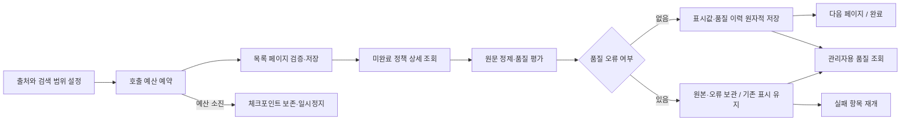

# 자동 수집·정제와 품질 조회 운영 계약

기준일: 2026-09-08 · `policy-dev` 적용 완료 · [최신 전체 범위 수집 결과](./policy-expansion-20260908.md)

고정 ID 표본을 지정하지 않고 Gov24·복지로 중앙·복지로 지자체의 목록을 탐색해 페이지별로 정제한다. 진행 상태와 품질 이력을 DB에 저장한다. 관리자 화면에서는 이 서버 전용 조회 계층을 재사용할 수 있다. 관리자 인증·화면은 이후 연결했다([관리자 운영 안내](../admin-console.md)). 예약 배포는 아직 연결하지 않았다.

## 처리 흐름



출처별 잠금은 기존 표본 수집·재처리와 공유한다. 단일 실행만 반영하며 모든 변경에 실행 ID·임대 세대·만료 검증이 적용된다. 자동 실행도 기존 `snapshot/apply/fail` 원자적 저장 경로를 사용한다.

페이지 무결성과 전체 범위 완전성은 다르다. 자동 수집은 정상 페이지의 정책부터 내부 DB에 반영하고, 모든 페이지·중복 ID·건수·종료 빈 페이지를 확인한 뒤에만 전체 실행을 SUCCESS로 끝낸다. 진행 중 저장값을 추천 공개 승인으로 해석하지 않는다. 전체 목록 완전성 검증을 먼저 마치는 기존 표본 CLI의 계약은 유지한다.

## 실행과 범위

기본 범위는 선택한 제공자 전체이며 자동 육아 분류나 동일 정책 병합을 하지 않는다. 관심 분야 범위는 출처 API의 실제 검색 필터를 설정한다. 키워드 검색 결과를 전체 육아 정책이라고 주장하지 않는다.

```bash
# 설정 확인 (API·DB 접근 없음)
npm run policy:auto -- --help

# 범위를 좁힌 설정 파일로 소규모 실행. ID 목록은 필요하지 않음.
POLICY_SYNC_ENABLED=true npm run policy:auto -- \
  --provider central --config scripts/policy/automatic-central-childcare.json \
  --call-budget 8 --max-items 3

# 출력된 runId로 미완료 항목부터 재개. 저장된 설정을 자동 사용.
POLICY_SYNC_ENABLED=true npm run policy:auto -- \
  --provider central --resume RUN_UUID --call-budget 60

# 명시적으로 한 제공자 전체 범위 실행: 기본 perPage=10, maxPages=1000,
# 일일 예약 호출 상한=100, 한 호출 프로세스 예산=40
POLICY_SYNC_ENABLED=true npm run policy:auto -- --provider gov24
```

provider는 `gov24`, `central`, `local`이다. 설정 JSON은 `filters`, `perPage`, `maxPages`, `dailyLimit`이다. Gov24는 기존 목록 서비스명/기관 LIKE 필터, 중앙은 `searchWrd/srchKeyCode`, 지역은 `searchWrd/ctpvNm/sggNm`를 허용한다. 중앙 `srchKeyCode` 기본값은 `003`이다. 확인하지 않은 분류코드·증분 수정일 필터를 임의로 추가하지 않는다.

CLI는 `.local/policy-sync/automatic/RUN_UUID.json`에 시작 직후 실행 ID를 기록하고 종료 시 결과를 갱신한다. 시작 후 연결이 끊겨도 이 ID 또는 관리자용 실행 목록으로 복구한다. raw 응답·인증키를 콘솔에 출력하지 않는다. 데이터와 체크포인트는 로컬 파일이 아닌 DB가 기준이다.

### 호출 예산과 규모

- `callBudget`: 한 프로세스에서 최대 1~100회. 재시도·페이지 재확인·종료 빈 페이지도 호출이다.
- `dailyLimit`: 자동 수집의 제공자별 UTC 일일 **예약 호출 상한**. 기본 100, 설정 범위 1~100,000. 같은 날 이미 설정된 상한은 새로운 실행이 더 큰 값으로 올릴 수 없다.
- DB에 호출을 먼저 예약한 후 HTTP를 실행한다. 예약 직후 중단되면 실제 호출보다 예약량이 클 수 있다. 프로세스를 재시작해도 이미 예약한 일일 호출량은 초기화되지 않는다.
- 이 값은 공공데이터포털 계정의 실제 할당량이 아니다. 다른 프로그램·기존 표본 CLI의 API 호출은 이 예약량에 포함되지 않는다. 실제 계정 한도·초기화 시각은 포털에서 별도로 확인해야 한다.
- 페이지 크기 1~100, 페이지 상한 1~1000이다. 종료 빈 페이지도 상한에 포함한다. 기본 페이지 크기 10으로 1000개는 데이터 100페이지와 종료 1페이지가 필요하다.
- Gov24는 기존 상세·지원조건의 완전성 검증 때문에 정책당 통상 최소 4회, 복지로는 상세 1회가 필요하다. 목록·재시도 비용은 별도다. 호출 한도를 추정해서 일괄 1000개 요청하지 않는다.
- 처리 완료한 페이지의 메모리 캐시는 제거한다. 페이지 진행과 원본 증거는 DB에 남아 후속 프로세스가 이어받는다.

### 중단·재개

`PAUSED`는 CLI/summary 상태다. 기존 실행 테이블의 상태는 성공 항목이 있으면 PARTIAL, 없으면 FAILED이며 `stop_reason`을 함께 읽는다. 프로세스 정상 종료(exit 0)만으로 전체 수집 완료라고 판단하지 않는다.

| 정지 사유 | 처리 |
| --- | --- |
| CALL_BUDGET | 같은 runId를 새 프로세스로 재개 |
| DAILY_BUDGET | 포털 한도와 UTC 예약일을 확인한 뒤 재개 |
| ITEM_LIMIT | 검증용 제한에 도달. 같은 runId를 재개 |
| PAGE_LIMIT | 해당 설정 범위가 미완료. 원인 확인 후 더 적합한 새 설정으로 새 실행 |
| UPSTREAM_ERROR | 실패 정책의 품질 이력·실행 오류를 확인한 뒤 같은 실행을 재개 |
| SOURCE_DRIFT | 페이지 ID 순서·건수 등 변경. 완전성 보장 불가, 범위를 재검토해 새 실행 |

재개 시 이미 성공한 정책은 건너뛰고 미완료 정책이 있는 페이지만 새로 조회한다. 저장 페이지의 ID 순서·총건수와 달라지면 섞어 저장하지 않는다. 목록과 상세는 기존 10분 이내 수집 계약을 유지하며 오래된 페이지도 다시 확인한다. 제공 API는 스냅샷 커서를 제공하지 않으므로 페이지 검증으로 모든 동시 변경을 탐지한다고 주장하지 않는다. 목록에서 사라진 ID를 자동 삭제하지 않는다.

DB 연결·잠금 오류는 원문 오류로 바꿔 기록하지 않는다. 프로세스가 비정상 종료되면 RUNNING이 남을 수 있으므로 관리자 조회의 `lease_active`와 종료 시각을 함께 확인하고, 임대 만료 후 같은 실행을 재개한다.

## 품질 데이터

평가 버전은 `policy-quality-1`이다. 출처·실행·정책 ID·스냅샷·정제 버전·평가 시각과 함께 저장한다. 재처리와 재시도 결과도 별도 관찰 이력으로 남기며 현재 표시값에 대응하는 평가인지는 `matches_current`로 구분한다.

| 항목 | 의미 |
| --- | --- |
| required/present/missing | 정책명·요약·대상·내용·기관·공식 출처 URL, 필수 6개 필드의 존재 개수 |
| SOURCE_FIELD_MISSING | 원문 정보 부족. 신청기간·서류 등의 누락을 ‘없음’으로 확정하지 않음 |
| DEDICATED_FIELD_MISSING_TEXT_RETAINED | 전용 필드는 없지만 다른 본문에 관련 표현이 보존됨. 자동 자격·기한 추출은 아님 |
| INVALID_URL / SOURCE_LINK_MISMATCH / POSSIBLE_URL_TRUNCATION | 문법·출처 ID·잘림 의심 문제 |
| MODIFIED_DATE_MISSING / INVALID_MODIFIED_DATE | 수정 시점의 정보 부족·형식 문제 |
| DISPLAY_CONTENT_LOST / NUMERIC_CONTENT_MISMATCH / 해시·식별 오류 | 정제 결과의 기술적 오류. 자동 반영 보류 |
| RAW_SOURCE_CHANGED / CONDITION_EVIDENCE_CHANGED / TRANSFORMATION_VERSION_CHANGED | 원문·조건 근거·정제 버전 변경. 의미 변경 확정은 아님 |
| UNVERIFIED 종류 | 링크 접속·현행 공식 근거·자격 비교는 아직 별도 검수 필요 |

PASS는 기술적 검사 통과, REVIEW는 추가 확인할 원문·표시 항목 존재, ERROR는 반영을 보류할 정제·수집 오류다. 기존 호출자가 품질을 제공하지 않는 경우 NOT_EVALUATED로 남겨 평가 성공을 꾸미지 않는다. 기존 표본 수집/재처리도 이제 품질 평가를 함께 전달한다.

필수값 6/6은 내용 정확도 100%가 아니다. `comparisonReady`는 이 평가에서 항상 false이다. 공통 누락을 출처·코드별로 집계해 어댑터나 매핑 수준에서 해결하고, ERROR·충돌·변경 근거를 우선 검토할 수 있다. REVIEW 정책 수를 모두 사람이 개별 판독해야 할 작업 수로 해석하지 않는다.

## 관리자 페이지용 조회

[서버 조회 모듈](../../src/features/policy/server/admin-quality.ts)의 `createPolicyQualityReader()`를 사용한다.

- `overview(provider?)`: 현재 정책 수, 현재 평가 상태·필수값 집계, 미평가 수, 일일 예약 호출량.
- `runs(filters)`: 실행 상태·진행 페이지·발견 건수·전체 범위 완료·정지 사유·실제 임대 활성 여부.
- `quality(filters)`: 출처·실행·평가 상태·이슈 코드별 품질 이력. `beforeId` 커서 페이지 이동 지원.
- 기본 50개, 최대 100개 단위 조회. 실행은 시각+UUID, 품질은 ID 기반 커서로 중복 없는 페이지 이동.
- 원문 XML·raw/normalized JSON·요청 증거는 이 조회 응답에 포함하지 않는다.

```bash
npm run policy:quality -- --provider BOKJIRO_CENTRAL --limit 50
npm run policy:quality -- --run RUN_UUID --status ERROR
npm run policy:quality -- --code SOURCE_FIELD_MISSING --output /tmp/policy-quality.json
```

모든 새 테이블에 RLS를 켜고 anon/authenticated의 읽기·쓰기와 두 RPC 실행을 차단했다. `service_role`만 서버에서 조회·수집할 수 있다. **향후 관리자 API를 만들 때는 서버에서 관리자 권한을 확인한 후 조회 모듈을 호출해야 한다.** 일반 로그인 사용자에게 이 RPC 권한이나 서버 키를 제공하지 않는다. 함수는 [Supabase의 SECURITY INVOKER·권한 지침](https://supabase.com/docs/guides/database/functions)에 맞춘다.

## 초기 개발 DB 검증 결과

아래 50개는 초기 검증 시점의 기록이다. 이후 전체 범위 수집 결과는 215개이며 [최신 보고서](./policy-expansion-20260908.md)를 기준으로 한다.

[검증 근거](../fixtures/policy-automatic/validation.json): 중앙 “양육” 검색 40개 자동 탐색·정제·품질 기록 완료. 3개 처리 후 ITEM_LIMIT으로 멈추고 재개해 나머지 37개를 처리했다. 총 50회(목록 8페이지·종료 1페이지·재개 확인 1페이지·상세 40개), 성공 항목의 재시도 횟수·스냅샷 유지, 전체 실행 SUCCESS·미완료 0·잠금 해제를 확인했다.

Gov24 8개와 복지로 지자체 2개 저장 표본도 API 0회로 품질을 보강했다. 현재 출처별 레코드 50개에 평가 50개, 필수값 300/300 존재, REVIEW 50·ERROR 0·현재 미평가 0이다. 중앙의 주된 경고는 전용 신청기간/서류 누락과 세부 수정일 미제공이다. 이 결과는 전체 복지로·전체 육아 정책 수나 현행 자격 정확도 보장이 아니다.

마이그레이션 `20260908053334_policy_automatic_quality.sql`은 개발 DB에 적용하고 이력·타입을 갱신했다. 초기 MCP DDL은 읽기 전용 연결이라 실행되지 않았으며, 관리 토큰을 사용하는 공식 CLI로 전체 DDL과 이력을 한 트랜잭션에 적용했다. 재적용하지 않는다. 새 대상에 대한 보안 WARN은 없고 기존 프로젝트 공통 `rls_auto_enable` WARN 2개는 별개다.

로컬 테스트는 1001개 자동 목록 저장, 중단·재개, 일일 예약 한도, 원자적 품질 반영, 오류 격리, 실제 XML 통합, 관리자 필터·커서·권한을 검증한다. 전체 빌드는 일반 실행과 권한 실행 모두 Turbopack 프로세스/포트 생성 `Operation not permitted`로 실패했다. 타입·lint·정책 테스트 결과와 빌드 성공을 혼동하지 않는다.

## 후속 연결

관리자 인증·화면에서 위 조회와 실행/재개 동작을 연결하고, 실제 계정 호출 한도 및 배포 플랫폼을 확인한 뒤 예약 실행기를 연결한다. 정제기 자체의 자동화는 완료했지만 12시간 예약·배포·장기 무인 운영은 아직 검증하지 않았다. 출처 간 금액 충돌이나 자격 비교 규칙 검수는 별도 업무다.
