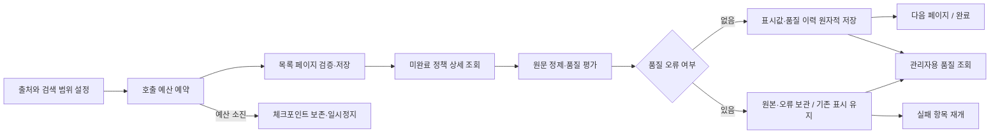

# 정책 수집·품질 운영

에이전트가 수집·재처리·실패 진단에 사용하는 계약이다. 모든 명령은 저장소 루트에서 실행한다. 자동 탐색, 고정 ID 표본 수집, 읽기 전용 탐색은 범위·예산·완전성 조건이 다르므로 해당 절을 따른다. 품질 평가·관련성 분류·라벨 검수·공개 승인·자격 비교는 별도 단계다.

2026-09-11 별도 수집 요청으로 신규 전용 탐색을 실행했고, 내부 일일 100회 한도에서 중단했다. 신규 반영 0건·기존 586건 건너뜀·전체 수집 미완료다. 최신 실행 근거는 [수집 이력](../records/collection-history.md#2026-09-11--추천-구현과-병행한-신규-수집)을 따른다.

그 이전 2026-09-09 수집은 `PARTIAL / USER_STOPPED`로 종료됐고 직전 저장 오류를 보존했다. **별도 수집 요청 전에는 그 실행을 재개하지 않는다.** 이는 현재 DB를 다시 조회한 결과가 아니다. 최종 수치·종료·복구 증거는 [날짜별 수집 기록](../records/collection-history.md#policy-collection-20260909)을 따른다. 아래 명령의 존재나 과거 임시 한도 확대는 새 실행 권한을 뜻하지 않는다.

운영 기본값은 새 자동 CLI 실행의 `new-only`다. 갱신은 명시적 `refresh`로 별도 수행한다. 관리자 인증·화면의 조회 및 실행/재개 연결은 [관리자 운영 기준](../../admin-console.md)을 따른다. 12시간 예약·배포·장기 무인 운영은 별도 검증 대상이다.

## 공통 준비와 저장 원칙

Node 24 이상, `.env.local`의 출처별 API 키, DB 접근 시 서버용 `SUPABASE_URL`·`SUPABASE_SECRET_KEY`가 필요하다. 실제 키·원본 오류 응답을 명령 인자·문서·브라우저·로그에 노출하지 않는다. 로컬 원본·진단 산출물은 Git 제외로 보관하고 fixture 승격 전 비밀값을 검사한다.

쓰기에는 `POLICY_SYNC_ENABLED=true`가 필요하다. 원격 마이그레이션은 대상 프로젝트 이력을 확인하며, 이미 적용한 이력을 재적용하거나 동명 객체를 덮어쓰지 않는다. 개발 DB에 적용한 `20260907181933_policy_ingestion.sql`, `20260907192856_policy_multiple_providers.sql`, `20260908053334_policy_automatic_quality.sql`, 새 자동 모드의 `20260909091358` 기록은 [구현·검증 이력](../records/classification-and-operations-history.md)과 [9월 9일 기록](../records/collection-history.md#policy-collection-20260909)에 있다.

## 자동 목록 탐색과 품질 조회

### 처리 흐름



출처별 잠금은 기존 표본 수집·재처리와 공유한다. 단일 실행만 반영하며 모든 변경에 실행 ID·임대 세대·만료 검증이 적용된다. 자동 실행도 기존 `snapshot/apply/fail` 원자적 저장 경로를 사용한다.

페이지 무결성과 전체 범위 완전성은 다르다. 자동 수집은 정상 페이지의 정책부터 내부 DB에 반영하고, 모든 페이지·중복 ID·건수·종료 빈 페이지를 확인한 뒤에만 전체 실행을 SUCCESS로 끝낸다. 진행 중 저장값을 추천 공개 승인으로 해석하지 않는다. 전체 목록 완전성 검증을 먼저 마치는 기존 표본 CLI의 계약은 유지한다.

### 실행과 범위

기본 탐색 범위는 선택한 제공자 전체다. 수집 과정의 서비스 관련성 평가·자동 라벨 제안은 [분류 계약](classification.md)을 따르며, 출처 간 동일 정책을 자동 병합하지 않는다. 관심 분야 범위를 좁히려면 출처 API의 실제 검색 필터를 설정한다. 키워드 검색 결과를 전체 육아 정책이라고 주장하지 않는다.

```bash
# 설정 확인 (API·DB 접근 없음)
npm run policy:auto -- --help

# 범위를 좁힌 설정 파일로 소규모 실행. ID 목록은 필요하지 않음.
POLICY_SYNC_ENABLED=true npm run policy:auto -- \
  --provider central --config scripts/policy/automatic-central-childcare.json \
  --call-budget 8 --max-items 3

# 출력된 runId로 미완료 항목부터 재개. 저장된 설정을 자동 사용.
POLICY_SYNC_ENABLED=true npm run policy:auto -- \
  --provider central --resume RUN_UUID --call-budget 60

# 명시적으로 한 제공자 전체 범위 실행: 기본 perPage=10, maxPages=1000,
# 일일 예약 호출 상한=100, 한 호출 프로세스 예산=40
POLICY_SYNC_ENABLED=true npm run policy:auto -- --provider gov24

# 기존 정책 갱신이 필요할 때 별도로 실행
POLICY_SYNC_ENABLED=true npm run policy:auto -- --provider gov24 --mode refresh
```

provider는 `gov24`, `central`, `local`이다. 설정 JSON은 `filters`, `perPage`, `maxPages`, `dailyLimit`, 선택적 `mode`이다. Gov24는 기존 목록 서비스명/기관 LIKE 필터, 중앙은 `searchWrd/srchKeyCode`, 지역은 `searchWrd/ctpvNm/sggNm`를 허용한다. 중앙 `srchKeyCode` 기본값은 `003`이다. 확인하지 않은 분류코드·증분 수정일 필터를 임의로 추가하지 않는다.

#### 미저장 정책 우선 수집

새 CLI 실행은 기본 `new-only`다. 목록은 조회하지만 같은 **출처 + 외부 정책 ID**의 현재 정책이 DB에 있으면 상세·지원조건 API를 호출하지 않는다. 원본 스냅샷만 있고 정제 정책이 없는 항목은 미저장으로 보고 수집한다. 출처가 다른 정책을 제목만으로 합쳐 건너뛰지 않는다.

기존 저장 항목은 `skippedExisting`로 별도 집계하며 신규 반영·갱신 성공이나 무관 정책 제외 수에 포함하지 않는다. 이력과 재개 체크포인트만 기록하고 기존 정책·스냅샷·품질·라벨은 갱신하지 않는다. 목록 조회·페이지 재확인 비용은 여전히 발생한다. 전체 목록 탐색 완료는 기존 정책의 최신성 확인을 뜻하지 않는다.

`--mode refresh`는 기존 동작대로 저장된 정책도 상세 조회한다. 신규 확보 후 필요할 때 별도로 실행하며 자동으로 갱신 단계에 넘어가지 않는다. 재개는 저장된 모드를 유지한다. 모드가 없는 과거 실행과 저수준 `runAutomatic` 호출은 호환성을 위해 기존 갱신 방식이다. 미저장 우선으로 전환하려면 새 실행을 시작한다.

CLI는 `.local/policy-sync/automatic/RUN_UUID.json`에 시작 직후 실행 ID를 기록하고 종료 시 결과를 갱신한다. 시작 후 연결이 끊겨도 이 ID 또는 관리자용 실행 목록으로 복구한다. raw 응답·인증키를 콘솔에 출력하지 않는다. 데이터와 체크포인트는 로컬 파일이 아닌 DB가 기준이다.

#### 호출 예산과 규모

- `callBudget`: 한 프로세스에서 최대 1~100회. 재시도·페이지 재확인·종료 빈 페이지도 호출이다.
- `dailyLimit`: 자동 수집의 제공자별 UTC 일일 **예약 호출 상한**. 기본 100, 설정 범위 1~100,000. 같은 날 이미 설정된 상한은 새로운 실행이 더 큰 값으로 올릴 수 없다.
- DB에 호출을 먼저 예약한 후 HTTP를 실행한다. 예약 직후 중단되면 실제 호출보다 예약량이 클 수 있다. 프로세스를 재시작해도 이미 예약한 일일 호출량은 초기화되지 않는다.
- 이 값은 공공데이터포털 계정의 실제 할당량이 아니다. 다른 프로그램·기존 표본 CLI의 API 호출은 이 예약량에 포함되지 않는다. 실제 계정 한도·초기화 시각은 포털에서 별도로 확인해야 한다.
- 페이지 크기 1~100, 페이지 상한 1~1000이다. 종료 빈 페이지도 상한에 포함한다. 기본 페이지 크기 10으로 1000개는 데이터 100페이지와 종료 1페이지가 필요하다.
- Gov24는 기존 상세·지원조건의 완전성 검증 때문에 정책당 통상 최소 4회, 복지로는 상세 1회가 필요하다. 목록·재시도 비용은 별도다. 호출 한도를 추정해서 일괄 1000개 요청하지 않는다.
- 처리 완료한 페이지의 메모리 캐시는 제거한다. 페이지 진행과 원본 증거는 DB에 남아 후속 프로세스가 이어받는다.

#### 중단·재개

`PAUSED`는 CLI/summary 상태다. 기존 실행 테이블의 상태는 성공 항목이 있으면 PARTIAL, 없으면 FAILED이며 `stop_reason`을 함께 읽는다. 프로세스 정상 종료(exit 0)만으로 전체 수집 완료라고 판단하지 않는다.

| 정지 사유 | 처리 |
| --- | --- |
| CALL_BUDGET | 같은 runId를 새 프로세스로 재개 |
| DAILY_BUDGET | 포털 한도와 UTC 예약일을 확인한 뒤 재개 |
| ITEM_LIMIT | 검증용 제한에 도달. 같은 runId를 재개 |
| PAGE_LIMIT | 해당 설정 범위가 미완료. 원인 확인 후 더 적합한 새 설정으로 새 실행 |
| UPSTREAM_ERROR | 실패 정책의 품질 이력·실행 오류를 확인한 뒤 같은 실행을 재개 |
| SOURCE_DRIFT | 페이지 ID 순서·건수 등 변경. 완전성 보장 불가, 범위를 재검토해 새 실행 |

재개 시 이미 성공한 정책은 건너뛰고 미완료 정책이 있는 페이지만 새로 조회한다. 저장 페이지의 ID 순서·총건수와 달라지면 섞어 저장하지 않는다. 목록과 상세는 기존 10분 이내 수집 계약을 유지하며 오래된 페이지도 다시 확인한다. 제공 API는 스냅샷 커서를 제공하지 않으므로 페이지 검증으로 모든 동시 변경을 탐지한다고 주장하지 않는다. 목록에서 사라진 ID를 자동 삭제하지 않는다.

DB 연결·잠금 오류는 원문 오류로 바꿔 기록하지 않는다. 프로세스가 비정상 종료되면 RUNNING이 남을 수 있으므로 관리자 조회의 `lease_active`와 종료 시각을 함께 확인하고, 임대 만료 후 같은 실행을 재개한다.

### 품질 데이터

평가 버전은 `policy-quality-1`이다. 출처·실행·정책 ID·스냅샷·정제 버전·평가 시각과 함께 저장한다. 재처리와 재시도 결과도 별도 관찰 이력으로 남기며 현재 표시값에 대응하는 평가인지는 `matches_current`로 구분한다.

| 항목 | 의미 |
| --- | --- |
| required/present/missing | 정책명·요약·대상·내용·기관·공식 출처 URL, 필수 6개 필드의 존재 개수 |
| SOURCE_FIELD_MISSING | 원문 정보 부족. 신청기간·서류 등의 누락을 ‘없음’으로 확정하지 않음 |
| DEDICATED_FIELD_MISSING_TEXT_RETAINED | 전용 필드는 없지만 다른 본문에 관련 표현이 보존됨. 자동 자격·기한 추출은 아님 |
| INVALID_URL / SOURCE_LINK_MISMATCH / POSSIBLE_URL_TRUNCATION | 문법·출처 ID·잘림 의심 문제 |
| MODIFIED_DATE_MISSING / INVALID_MODIFIED_DATE | 수정 시점의 정보 부족·형식 문제 |
| DISPLAY_CONTENT_LOST / NUMERIC_CONTENT_MISMATCH / 해시·식별 오류 | 정제 결과의 기술적 오류. 자동 반영 보류 |
| RAW_SOURCE_CHANGED / CONDITION_EVIDENCE_CHANGED / TRANSFORMATION_VERSION_CHANGED | 원문·조건 근거·정제 버전 변경. 의미 변경 확정은 아님 |
| UNVERIFIED 종류 | 링크 접속·현행 공식 근거·자격 비교는 아직 별도 검수 필요 |

PASS는 기술적 검사 통과, REVIEW는 추가 확인할 원문·표시 항목 존재, ERROR는 반영을 보류할 정제·수집 오류다. 기존 호출자가 품질을 제공하지 않는 경우 NOT_EVALUATED로 남겨 평가 성공을 꾸미지 않는다. 기존 표본 수집/재처리도 이제 품질 평가를 함께 전달한다.

필수값 6/6은 내용 정확도 100%가 아니다. `comparisonReady`는 이 평가에서 항상 false이다. 공통 누락을 출처·코드별로 집계해 어댑터나 매핑 수준에서 해결하고, ERROR·충돌·변경 근거를 우선 검토할 수 있다. REVIEW 정책 수를 모두 사람이 개별 판독해야 할 작업 수로 해석하지 않는다.

### 관리자 페이지용 조회

[서버 조회 모듈](../../../src/features/policy/server/admin-quality.ts)의 `createPolicyQualityReader()`를 사용한다.

- `overview(provider?)`: 현재 정책 수, 현재 평가 상태·필수값 집계, 미평가 수, 일일 예약 호출량.
- `runs(filters)`: 실행 상태·진행 페이지·발견 건수·전체 범위 완료·정지 사유·실제 임대 활성 여부.
- `quality(filters)`: 출처·실행·평가 상태·이슈 코드별 품질 이력. `beforeId` 커서 페이지 이동 지원.
- 기본 50개, 최대 100개 단위 조회. 실행은 시각+UUID, 품질은 ID 기반 커서로 중복 없는 페이지 이동.
- 원문 XML·raw/normalized JSON·요청 증거는 이 조회 응답에 포함하지 않는다.

```bash
npm run policy:quality -- --provider BOKJIRO_CENTRAL --limit 50
npm run policy:quality -- --run RUN_UUID --status ERROR
npm run policy:quality -- --code SOURCE_FIELD_MISSING --output /tmp/policy-quality.json
```

모든 새 테이블에 RLS를 켜고 anon/authenticated의 읽기·쓰기와 두 RPC 실행을 차단한다. `service_role`만 서버에서 조회·수집할 수 있다. 관리자 API는 서버에서 관리자 권한을 확인한 후 조회 모듈을 호출한다. 일반 로그인 사용자에게 이 RPC 권한이나 서버 키를 제공하지 않는다. 함수는 [Supabase의 SECURITY INVOKER·권한 지침](https://supabase.com/docs/guides/database/functions)을 따른다.

## Gov24 고정 표본 수집·재처리

초기 범위는 `scripts/policy/selection.json`의 검증된 8개 ID다. UI·추천·자격 판정과 연결하지 않는다. Node 24, `.env.local`의 `GOV24_API_KEY`, DB 실행에는 `SUPABASE_URL`/`SUPABASE_SECRET_KEY`가 필요하다. 비밀은 서버 환경에만 저장한다.

`SUPABASE_ACCESS_TOKEN`은 로컬 관리 API/마이그레이션용이며 배포되는 수집기에는 필요 없다. 수집기의 데이터 접근에는 `SUPABASE_SECRET_KEY`만 사용한다.

마이그레이션은 새 6개 테이블과 서버 전용 RPC를 생성한다. 기존 동명 객체가 있으면 덮어쓰지 말고 충돌을 확인한다. 수집 데이터는 공개 서비스 설명이지만 원본/로그/쓰기 API는 일반 사용자에게 열지 않는다. 전체 정책 수집으로 범위를 자동 확대하지 않는다.

### 수동 실행

```bash
# 실제 API → 완전성 검사 → 정규화 → 로컬 파일. DB 접근 없음.
npm run policy:prepare

# 원격 스키마 적용 후: 실제 API + 기존 DB 비교, DB 쓰기 없음.
npm run policy:sync -- --dry-run

# 개발 DB 수동 쓰기 실행. 환경변수는 이 프로세스에만 적용.
POLICY_SYNC_ENABLED=true npm run policy:sync

# 성공 항목은 보존하고 실패/중단 항목의 세 API를 새로 수집.
POLICY_SYNC_ENABLED=true npm run policy:sync -- --resume 실행_UUID

# 현재 적용 스냅샷을 API 재호출 없이 재정규화.
npm run policy:sync -- --reprocess --dry-run
POLICY_SYNC_ENABLED=true npm run policy:sync -- --reprocess
```

`--budget` 기본 100(최대 200), `--per-page` 기본 100(최대 100), `--max-pages` 기본 20(최대 20). 요청 재시도도 예산에 포함한다. 계정 일일 한도·초기화는 포털에서 별도로 확인한다.

선정 파일을 바꾸려면 `--selection 파일`을 사용하되 5~10개 ID와 실제 검토 이유·지원되는 목록 필터가 필요하다. 재개 시에는 원 실행의 scope를 DB에서 읽는다. 이전 실행이 reprocess였다면 재개 시에도 `--reprocess`를 지정한다. SUCCESS 실행은 재개하지 않고 새로 실행한다.

결과는 `.local/policy-prepared/`, `.local/policy-sync/`에 저장하며 Git 제외 대상이다. PREPARED는 로컬 정제 성공, SUCCESS는 해당 실행 범위의 DB 반영 완료, PARTIAL은 일부 실패, FAILED는 전체/선행 실패, SKIPPED는 다른 유효 실행 존재를 뜻한다. dry-run 결과는 읽기 시점의 참고용이고 이후 실제 반영 결과를 보장하지 않는다.

### 실패·중지·재개

- 인증/권한/429: 자동 반복을 중단한다. 키·계정 한도를 확인하고 다음 수동 실행으로 재개한다.
- 네트워크/5xx: 최대 3회 시도, 짧은 지연과 jitter. Retry-After가 10초를 넘으면 현재 실행에서 기다리지 않고 보류한다.
- 목록 누락·중복·건수 변화·페이지 상한·예산 소진: 미완료로 기록한다. 빠진 정책을 삭제하지 않는다.
- 날짜 역전·형식 미확인: 수집 원본을 저장하고 표시 반영을 보류한다. UTC 시간대를 추정하거나 과거/최신 응답을 섞지 않는다.
- 정책 실패: 기존 표시·적용 스냅샷 유지. 실패/중단 evidence와 snapshotId는 항목의 `attempt_history`에 보존되며 재개해도 지우지 않는다.
- 프로세스 중단: 최대 120초 임대 만료 후 원 실행 ID로 재개한다. 임의로 잠금 행을 삭제하지 않는다. 새 세대가 발급되면 이전 실행은 쓰기 거부된다.
- 중지: `POLICY_SYNC_ENABLED`를 false/빈 값으로 설정해 새 CLI 쓰기 실행을 차단한다. 이미 실행 중인 프로세스는 종료한 뒤 임대 만료를 기다린다.

원격 SQL 관리 연결로 서버만 `policy_sync_command('run', '{"runId":"..."}')`을 호출하여 실행/항목을 확인할 수 있다. 오류 원문 대신 분류 코드·실행 ID·정책 ID로 진단하며 외부 인증 URL/헤더는 로그에 쓰지 않는다. 호출 수는 완료 시 합산되므로 강제 종료 직전 호출은 run.calls에 누락될 수 있다. 로컬 요청 산출물과 항목 evidence로 보완하며 계정 사용량은 포털에서 확인한다.

현재 재정규화 CLI는 **현재 적용된** 스냅샷을 대상으로 한다. 적용되지 않은 격리 원본을 임의로 정상으로 승격하는 명령은 제공하지 않는다. 정상 API 재수집 또는 계약 수정·검증 후 별도 처리한다.

### 검증·예약

```bash
npm run policy:test
npm run lint
npx tsc --noEmit
npm run build
```

PGlite SQL 테스트는 PostgreSQL의 트랜잭션/제약/역할 동작을 검증한다. 별도 프로세스의 실제 DB 경합과 원격 Data API 역할 검증을 대체하지 않는다. 검증은 저장소 AGENTS.md에 따라 변경에 필요한 기존 검사와 필수 게이트를 선택한다.

12시간 예약 실행의 배포 대상·요금제·실행 한도·비밀 저장 방식이 미확정이다. `POLICY_SYNC_CRON_SECRET`은 예약 진입점 구현을 위한 예약 변수이며 아직 사용되지 않는다. 스케줄과 HTTP 진입점은 아직 등록/공개하지 않았고, 실제 12시간 간격 2회 성공도 미검증이다.

## 복지로 중앙·지자체 고정 표본 수집·재처리

### 구현 범위

- 엄격한 XML 부분집합 파서: 반복 요소·문자열·빈 태그·CDATA 보존, 잘못된 중첩·DTD·알 수 없는 엔티티 거부. 범용 XML 전체를 지원하는 파서는 아니다. 원문 XML은 함께 보관한다.
- HTTPS 고정 호스트, 리다이렉트 금지, 요청당 20초·2MiB 제한, 수동 호출 예산 최대 100. 인증·할당량 오류 후 추가 HTTP 요청을 차단한다. 초기 구현은 자동 재시도하지 않는다.
- 중앙 목록의 `srchKeyCode=003`과 양육 검색, 지자체 서울 중구 목록을 끝의 빈 페이지까지 검증한다. 목록 전체 필터가 완전해야 선정 ID의 상세를 반영한다.
- 표시 필드·원문 분류·추가 목록·날짜·출처·해시를 보존한다. 요약을 정책 목적으로, 시행 기간을 신청 기간으로 바꾸지 않는다. 미제공 신청기한·필수서류·신청 URL은 null로 남긴다.
- 모든 RPC에 provider를 전달한다. 생략한 기존 Gov24 호출은 계속 GOV24로 동작한다. 실행·잠금·원본 ID를 출처별로 검증하며 다른 출처의 실행 재개·쓰기·원본 교체를 거부한다.
- 재개 시 성공 항목을 건너뛰고 실패·미완료 항목을 다시 수집한다. 저장 원본 재처리는 API를 호출하지 않는다.
- 지역·소득·연령 등 실제 신청 자격 규칙은 자동 생성·공개하지 않는다.

### 실행

키는 `.env.local`의 BOKJIRO_CENTRAL_API_KEY, BOKJIRO_LOCAL_API_KEY를 사용한다. 선정 범위는 [bokjiro-selection.json](../../../scripts/policy/bokjiro-selection.json)이다.

```bash
# 기존값 조회와 정제 비교, DB 쓰기 없음
npm run policy:sync:bokjiro -- --provider central --dry-run
npm run policy:sync:bokjiro -- --provider local --dry-run

# 실제 저장: 환경변수는 이 프로세스에만 적용
POLICY_SYNC_ENABLED=true npm run policy:sync:bokjiro -- --provider central
POLICY_SYNC_ENABLED=true npm run policy:sync:bokjiro -- --provider local

# 저장 원본 재처리, 외부 API 호출 없음
POLICY_SYNC_ENABLED=true npm run policy:sync:bokjiro -- --provider central --reprocess

# 실패·미완료 실행 재개: 같은 출처·trigger 사용
POLICY_SYNC_ENABLED=true npm run policy:sync:bokjiro -- --provider local --resume RUN_UUID
```

기본 예산 40회, 페이지 크기 50, 페이지 상한 10이다. CLI는 `.local/policy-sync/bokjiro-*`에 비밀값을 제거한 요청·결과를 저장한다. 원본 XML이 들어간 파일을 새 fixture로 옮길 때도 비밀값 검사가 필요하다.


남은 한계:

- rawHash에는 해당 목록 페이지의 전체 XML도 포함된다. 다른 목록 행·조회수 변화가 해당 정책의 새 원본 스냅샷을 만들 수 있다. 정확히 같은 저장 원본 재처리의 중복 방지는 확인했으며, 의미 기준 중복 제거와는 다르다.
- v2 조건 해시는 목록·상세 근거를 보수적으로 포함한다. **해시 일치만으로 규칙 검수 완료를 유지하지 않는다.** 원본 변경·공식 근거의 현행성은 별도로 확인한다.
- 중앙은 기준연도만 있어 동일 연도 내 수정의 선후 관계를 보장하지 않는다. 지자체는 목록·상세 수정일의 달력 형식과 역전을 검사한다. 공식 접수·현행 자격 유효성은 별도 검수다.
- 실패 항목은 원본·표시가 유지되지만, 실행 중단 전에 소비한 호출 수는 finish 성공 여부에 따라 기록이 부족할 수 있다. 포털 호출량이 기준이다.

#### 정제 v2 변경 계약

`conditionsHash`는 선택된 정책의 파싱된 목록·상세 전체에서 `inqNum`, `resultCode`, `resultMessage`만 제외한 값을 해시한다. 지원내용·신청방법·시행/기준/수정 시점·법령·서식·미지 신규 필드까지 보수적으로 변경을 감지한다. 해시 변경은 재검수 신호이며 자격이 실제 변경되었다는 판정은 아니다. 원본 변경도 계속 확인하며, 이 해시만으로 검수 완료를 유지하지 않는다.

목록 페이지 전체 XML과 수집 evidence는 조건 해시에서 제외한다. 기존 `rawHash` 계약은 유지하므로 다른 행·조회수 변화가 새 스냅샷을 만들 수 있는 기존 한계는 남는다. 이 변경으로 DB 스키마를 추가하거나 기존 스냅샷을 교체하지 않는다.

```bash
# 오프라인 표본 감사: API·DB·인증키 사용 없음
node --experimental-strip-types scripts/policy/audit-bokjiro.ts \
  docs/fixtures/bokjiro/stored-validation.json /tmp/bokjiro-audit.json
```

## Gov24 읽기 전용 탐색과 표본 확보

DB 쓰기 없는 관찰 도구다. Node 24 이상에서 추가 npm 의존성 없이 실행한다. 수집기가 이미 구현되어 있으므로 아래 도구는 신규 표본이나 응답 계약을 조사할 때 사용한다.

### 준비와 후보 탐색

`.env.example`의 변수 이름을 참고하여 기존 `.env.local`에 `GOV24_API_KEY`를 추가한다. 기존 지도 API 설정을 덮어쓰지 않는다. 키는 공공데이터포털에서 해당 API 활용 승인된 키여야 한다. 실제 키를 명령 인자나 대화에 넣지 않는다.

```bash
npm run policy:probe -- search --keyword 양육 --per-page 5 --budget 1
npm run policy:probe -- search --keyword 출산 --agency 서울 --page 1 --per-page 5 --budget 1
```

`--page`를 바꿔 제한된 페이지를 탐색한다. 각 명령의 호출 예산에는 재시도도 포함된다. 계정 일일 한도와 초기화 시각은 별도로 확인해야 한다. 네트워크 제한 환경에서는 외부 API 접근이 가능한 실행 환경이 필요하다.

목록 응답은 `.local/policy-probe/<실행 디렉터리>/`에 보관된다. 각 실행의 요약과 원본을 검토하여 5~10개(목표 8개)를 선정한다. 서비스명·요약·지원대상·기관을 함께 읽고 선정 이유를 기록한다.

### 표본 수집

로컬 `selection.json`은 다음 형식으로 작성한다. 아래 한 행은 형식 설명이며 실제 표본이 아니다. `listRecord`에는 검색 산출물의 해당 목록 객체 전체를 복사한다.

```json
{
  "samples": [
    {
      "id": "실제 서비스ID",
      "reason": "원문을 검토한 선정 이유",
      "listRecord": { "서비스ID": "실제 서비스ID", "서비스명": "실제 서비스명" },
      "provenance": {
        "artifact": ".local/policy-probe/실행디렉터리/request-001.json",
        "rowIndex": 0
      }
    }
  ]
}
```

```bash
npm run policy:probe -- collect --samples .local/policy-probe/selection.json --per-page 5 --max-pages 3 --budget 40
```

서로 다른 ID 5~10개를 넣어야 한다. 저장된 검색 행과 입력의 일치를 확인한다. 상세·지원조건은 페이지별 전체 배열과 조회 메타데이터를 보존한다. 0건·복수·다른 ID·중복·건수 편차는 관찰 대상이며 정상 반영으로 해석하지 않는다. 예산·페이지 제한으로 수집하지 못한 범위가 있으면 전체 완료로 표시하지 않는다.

시차·페이지 크기·페이지 경계를 바꾼 추가 표본 조사가 필요하면 실제 결과를 [실응답 검증 보고서](../records/gov24-validation.md#policy-api-validation)와 [조건 코드 관찰표](../records/gov24-validation.md#policy-code-observations)에 기록한다. 새 응답 계약을 적용하려면 완전성·필수 식별 계약의 근거를 먼저 확보한다.

### 비밀 보호와 테스트

고정된 공식 API 주소로만 요청하고 인증 오류는 반복하지 않는다. 로컬 산출물은 Git에서 제외한다. 보관 자료를 실응답 fixture로 승격하기 전에 인증값 유출 여부와 내용을 검토한다.

```bash
npm run policy:test
npm run build
```

합성 응답으로 호출 예산·실패·ID 연결·비밀 제거 등을 검증한다. 테스트 통과가 인증 성공이나 실제 데이터 계약 검증을 뜻하지 않는다.
