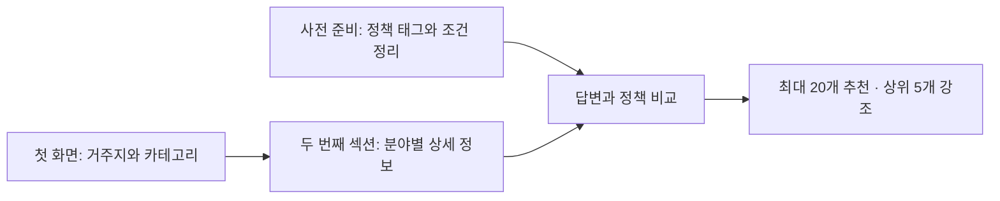

# 정책 추천 구현 계획

기준일: 2026-09-12 · 현재 코드와 저장소 기록 기준 · 답변·화면·규칙 연결 구현, 실제 정책 공개 검수 대기

구현 담당자용 계획입니다. 사용자에게 설명할 핵심 상태·트레이드오프는 [핵심 안내](../README.md)에서 관리합니다. 이 문서는 정책 조건과 답변을 연결하는 작업의 변경 대상·순서·완료 기준을 정합니다.

서비스 흐름은 합의된 기준을 요약하고, 질문·알고리즘·검수 계약은 담당 작업 문서에 연결합니다. 이 문서의 계획을 실행 완료로 해석하지 않습니다.

## 다음 작업 우선순위

기준 상태는 활성 3,430건·검토 대기 1,431건·제외 1,034건이다. 검토 대기는 전부 상세 검토와 사유 기록을 마쳤다. 수집은 사용자 요청 전까지 재개하지 않는다. 사용자용 요약은 [오늘·다음 작업](../today-and-next.md), DB 적용 근거는 [전체 정제 기록](../records/catalog-review-20260912.md)을 따른다.

| 순서 | 실행할 일 | 완료 증거 |
| --- | --- | --- |
| 1 | 관리자 REVIEW 최신 원문·판정을 다시 고정하고, 금액·연령·관할·가구 조건 충돌을 우선 확인. 일반 지원은 아동·가족 경로를 확인 | 정책별 공식 근거와 미해결 사유. 변경 시 정확한 원문·직전 판정 일치 확인 및 이력 보존. 보류를 없애기 위한 일괄 활성화 금지 |
| 2 | 활성 목록 기준 조건 작업 대상을 다시 집계. 기존 59건 초안부터 지역·나이·장애 등 대상 자격, 가구/개인 구분, OR 예외와 기준일 보완 | 6개 분야별 원문 인용·조건·예외·미확인 목록. 기존 2,173건 coverage는 과거 고정 표본이므로 최신 전체 분모로 사용하지 않음 |
| 3 | 미연결 `coarse-refinement-*-b-20260911.json` 자료의 중복·보류를 정리한 뒤 필요한 항목만 연결 | 가족 B의 RFB08 중복 해소, 원문·범주·인용·대상 검증. 미연결 자료를 59건에 합산하지 않음 |
| 4 | 실제 입력으로 6개 분야 추천 전후 비교 후 조건 공개 검수 | 지역 불일치·대체 자격·선택 자녀/가구·UNKNOWN 처리·최대 20개/상위 5개 검증. 공개 범위·근거·검수자 결정 기록 |

공식 근거를 더 확인해도 서비스 범위를 결정할 수 없다면, 포함했을 때의 오추천과 제외했을 때의 누락 사례를 함께 제시해 사용자에게 범위 결정을 요청한다. 코드 연결·카탈로그 활성·조건 검수·공개 승인을 구분한다.

## 1. 만들려는 서비스



| 단계 | 사용자가 경험하는 흐름 | 시스템이 하는 일 |
| --- | --- | --- |
| 사전 준비 | 사용자가 입력하기 전에 준비 | 정책마다 분야·목적 태그, 대상 조건, 순위 요소와 그 근거를 정리 |
| 첫 화면 | 거주지와 원하는 카테고리 선택 | 현재 주민등록 지역과 6개 분야 중 하나를 받음. 거주지는 모르면 건너뛸 수 있음 |
| 두 번째 섹션 | 선택한 분야에 필요한 상세 정보 입력 | 자녀·지원 목적·분야별 상황을 받고, 답변에 따라 필요한 질문만 표시 |
| 결과 | 최대 20개 정책과 추천 이유 확인 | 조건을 비교한 후보 전체를 정렬한 뒤 20개까지 선정. 상위 5개 강조와 추가 확인 사항 표시 |

카테고리는 **임신·출산, 양육·보육, 돌봄, 의료·건강, 아동 교육, 주거·생활지원**을 유지합니다. 상세 정보는 여러 질문 화면으로 나눌 수 있지만 사용자에게는 하나의 상세 입력 과정입니다. 질문 중에는 추천 카드를 보여주지 않고, 사용자가 입력을 마치거나 결과 보기를 선택하면 결과를 계산합니다.

모르는 항목은 건너뛸 수 있습니다. 결과가 7개라면 7개만 보여주며, 관련 없는 정책으로 20개를 채우지 않습니다. 5개 미만이면 있는 결과만 강조합니다.

## 2. 현재 어디까지 구현됐나

| 구성 | 현재 상태 | 남은 연결 |
| --- | --- | --- |
| 정책 수집·분류 | 기존 수집·원문·라벨 기반 유지 | 기존 AI 라벨을 인간 검수로 승격하지 않음 |
| 첫 화면·상세 입력 | 거주지·6개 분야, 기본 질문과 필요할 때의 추가 조건 질문 연결 | 실제 분야별 질문 검수 |
| 답변 비교 | 질문 사전의 의미를 FactKey에 연결. CHILD/PERSON/EVENT/HOUSEHOLD 구분, 연도·구간 정밀도 유지 | 정책별로 실제 사용하는 입력과 예외의 검수 |
| 추천 API·화면 | 검수 카탈로그가 있으면 조건 엔진, 아직 전환 전인 분야는 잠정 추천. 질문 중 카드 없음, 5문항 뒤 계속/종료, 최대 20개·상위 5개 | 승인된 실제 정책의 자격 판정 비교. 잠정 분류 전후 20건·9개 사례 비교 완료 |
| 공개·갱신 | 검수 결정과 초안 해시·원본 스냅샷·정제 버전·전체 정제 내용 지문 연결 | 실제 검수자의 결정 기록 |
| 교육 조건 준비 | 기존 20건 표본 + 재정제 5건: 19개 정책 초안·107규칙. 기존 6건 보류; 관악 일반 최초 신입학 3경로 충분조건 작성 | 불완전 경로·미확인 예외 보완, 공개 범위 결정 |
| 다른 5개 분야 조건 준비 | 임신 7·보육 6·돌봄 7·건강 10·주거 10건. 보육 원문 충돌 의심 1건 보류. 6개 분야 합계 59건·338규칙·26질문. 기본 검수 로더와 관리자 현황에 통합 | 공식 현행 기준·예외 보완, 전체 대상 정책 확대 및 분야별 검수 |

**코드 연결과 실제 정책 공개는 별도입니다.** `educationReviewDecisions`와 `familyReviewDecisions`는 비어 있고, 6개 분야 초안 59건은 `HIDDEN`, 규칙은 `UNREVIEWED`입니다. 실제 요청은 모든 분야에서 아직 잠정 추천을 사용합니다. 합성 테스트의 HUMAN 상태를 실제 승인으로 복사하지 않습니다.

2026-09-11 구현 범위·검증 결과·후속 절차는 [이번 구현 기록](../records/recommendation-integration-20260911.md)을 기준으로 봅니다. 과거 53개 테스트 기록은 이번 변경 검증과 구분합니다.

### 조건을 추가하는 방법

`recommendation/condition-templates.ts`의 10개 형식(기존 질문 수치 범위·출생일 범위·학교급·재학 상태·학년·학교 지역·소득인정액 비율·정책별 상태·수치 범위·기존 질문 코드)을 재사용합니다. `education-template-inputs-20260911.json`처럼 정책별 지원 경로의 조건·파라미터·원문 필드와 정확 인용·근거 공백을 입력합니다. 자유 문장을 자동으로 승인된 조건으로 해석하지 않습니다.

`template-compiler.ts`는 원문 인용·값·대상·중복을 검증하고 규칙과 공통 질문을 생성합니다. 기준일을 모르는 조건은 질문을 만들지 않으며, 모든 경로는 불완전 초안으로 남깁니다. 정책별 예외와 의미 검수는 계속 필요합니다. 공식 보충 자료는 원래 원본과 분리한 `evidenceDocuments`로 전달하고 `official.<slug>` 인용을 사용합니다. URL·보존 본문 해시를 규칙 근거에 결합하며 원본 지문은 바꾸지 않습니다. `/admin/recommendations`에서 표본별 준비 상태와 남은 사유를 확인합니다.

```bash
node --experimental-strip-types scripts/policy/prepare-recommendation-catalog.ts --out-dir /tmp/icom-policy-prepared
```

이 명령은 보존 교육 20건에 대한 오프라인 준비입니다. 출력은 `catalog.json`, `queue.json`, `summary.md`이며 잘못된 입력은 격리하고 종료 코드 1로 알립니다. 6개 분야 통합 준비는 아래 명령으로 재현하며 `six-field-preparation.json`에 분야별 초안·보류·공개 수를 기록합니다. 두 `family-fields-*-20260911.json`에 추가 분야의 원본과 조건을 보존하고 `six-field-prepared.ts`에서 교육 자료와 조합합니다.

```bash
node --experimental-strip-types scripts/policy/prepare-six-field-recommendations.ts --out-dir /tmp/icom-six-field-prepared
```

## 3. 구현 순서와 완료 기준

**완료 범위는 6개 분야 전체입니다. 교육만 공개하고 완료 처리하지 않습니다.** 교육은 최초 구현 표본이었습니다. 교육 20건 분석에서 E03·E04의 공식 초안과 추가 12건의 조건 템플릿을 준비했습니다. 이후에는 공통 변환기를 재사용해 조건·근거를 입력하고, 예외와 미확인 사항을 검수합니다. 정책마다 엔진 코드를 다시 작성하지 않습니다. 첫 화면의 6개 카테고리는 유지합니다.

| 순서 | 할 일 | 결과물과 완료 기준 |
| --- | --- | --- |
| 1. 정책 판단 자료 준비 | 6개 분야의 공식 근거·예외·지원 경로를 보완하고 태그와 조건을 정리 | 정책별 근거, 조건, 대상, 기준일, 미해결 사항, 검수 범위가 추적되는 자료. 합성 규칙을 실제 규칙으로 복사하지 않음 |
| 2. 답변 연결 | 기존 질문마다 연결 조건·변환 방식·사용 목적을 지정 | 질문 ID → 답변 의미 → 정책 규칙 → 판단 이유의 대응표. 미반영 항목은 이유와 후속 작업을 명시 |
| 3. 실제 추천 연결 | 서버가 검수된 정책 자료와 답변을 엔진에 전달하고 결과를 화면에 연결 | 실제 정책으로 후보 선정·순위·20개 제한·Top 5·수정 후 재계산까지 동작. 기존 잠정 추천과 조건 판정 결과의 범위를 구분 |
| 4. 6개 분야 비교 검증 | 지역·대상자·사건·자녀 수·필요를 바꿔 기존 방식과 결과 비교 | 같은 입력의 전후 목록, 추천/제외 이유, 잘못된 상위 노출과 미확인 처리 검토 기록 |
| 5. 전체 적용 확인 | 6개 분야별 정책 범위·검수·공개·미적용 사유를 대조 | 모든 분야에서 검수된 조건 추천 동작과 비교 사례 확보. 미적용 정책의 사유를 추적하며 표본 연결만으로 완료 처리하지 않음 |

E03는 기장군 교복 지원, E04는 관악구 입학준비금 사례입니다. 구체적인 누락 근거와 검수 항목은 [공개 검토 자료](../records/education-review.md#policy-recommendation-release-review)에 있습니다. 그 문서의 날짜·금액은 과거 저장 자료와 확인 기록이며 최신 공식 기준으로 재사용하기 전에 확인해야 합니다.

검토 대기 정책도 사용자 결정에 따라 `CHECK_REQUIRED` 상태와 ‘직접 확인 필요’ 태그·공식 확인 안내로 표시합니다. 검수된 규칙 결과를 먼저 배치하고 나머지 칸을 검토 대기 정책으로 채워 합계 최대 20개·상위 5개를 유지합니다. 두 점수 체계는 비교하지 않습니다. 현재 유효한 규칙을 가진 정책 전체를 잠정 후보에서 먼저 제외하여 조건 불일치 정책의 재등장과 중복을 막습니다. 원본 변경·검수 만료 정책은 현행 활성 목록에서 분야·지역이 맞으면 직접 확인 항목으로 표시할 수 있습니다. 정제·검수가 완료되면 태그 없이 검수된 경로로 이동합니다. 전환 단위와 실패 시 동작은 3단계의 서버 연결에서 명시하고 검증합니다.

## 4. 정책에 어떤 정보를 준비할까

태그·조건·순위 요소는 역할이 다릅니다. 다음은 필요한 의미를 정리한 표이며, 확정된 DB 컬럼이나 새 저장소 구현을 뜻하지 않습니다.

| 정보 | 예시 | 추천에서의 역할 |
| --- | --- | --- |
| 분류 태그 | 아동 교육, 교복, 입학준비 | 사용자가 선택한 분야의 후보를 찾음 |
| 대상 조건 | 특정 지역 주민등록, 고등학교 신입학, 정책이 정한 소득 범위 | 같은 수혜자의 조건을 비교해 명확한 불충족을 판별 |
| 추천 요소 | 원하는 지원 목적, 필요한 시점, 방문·기관 이용 등 선호 방식 | 남은 후보의 우선순위를 결정 |
| 지원·신청 정보 | 지원 내용, 신청 기간, 제출 서류, 공식 링크 | 결과 안내. 신청 기간과 실제 이용·지급 시기를 구분 |
| 근거와 유효성 | 원문 위치·버전, 적용 대상·기준일, 검수와 공개 결정, 누락·충돌 | 그 정보를 비교에 사용할 수 있는지 판단하고 변경 시 재검토 |

한 정책에 여러 지원 경로가 있으면 경로별로 조건을 기록합니다. ‘학교급 A 또는 B’, ‘특정 지원을 받는 경우 제외’ 같은 예외를 평평한 태그 목록으로 바꾸면 안 됩니다. 같은 이름의 다른 지역 정책이나 출처별 상충 내용을 임의로 합치지 않습니다.

기존 라벨의 `VERIFIED`는 AI 보조 검수 상태일 수 있습니다. 실제 추천의 공개 결정과 조건·질문 규칙의 인간 검수는 각각 근거와 범위를 남겨야 합니다. 저장·검수·원문 변경 시 처리의 상세 계약은 [정책 처리 기준](recommendation-engine.md)을 따릅니다.

## 5. 상세 답변을 어떻게 연결할까

| 입력 | 연결할 정책 정보 | 지켜야 할 의미 |
| --- | --- | --- |
| 카테고리·관심 지원 | 분야·지원 목적 태그 | 카테고리는 하나, 세부 관심은 복수 선택 가능. 선호하지 않는다고 자격 탈락은 아님 |
| 현재 거주지 | 주민등록/실거주 기준, 적용 지역, 대상자·기준일 | 기관 소재지를 거주 제한으로 추정하지 않음. 현재 주소를 과거 기준일 주소로 사용하지 않음 |
| 자녀별 성별·출생연도 | 정책이 실제로 요구하는 대상 조건·연령 기준 | 정확한 생일·학년을 추정하지 않음. 연령 경계를 판단할 수 없으면 미확인 |
| 교육 상황·학교급·학년·학교 위치 | 같은 자녀와 입학/재학 사건의 조건 | 학교 위치와 거주지는 별도. 첫째의 나이와 둘째의 학교급을 합치지 않음 |
| 분야별 상황·선호 | 임신 단계, 보육 이용, 돌봄 시간, 주거 형태 등 | 현재 상태와 앞으로 원하는 상태를 구분. 월세 거주만으로 가구 전체 무주택을 확정하지 않음 |
| 필요한 시점 | 실제 지원 이용 가능 기간 | 사용자의 ‘지금 필요’를 신청 접수 중·즉시 지급으로 해석하지 않음 |
| 필요한 경우의 추가 질문 | 정책별 소득 기준·거주 기간·입학 연도·특정 중복지원 조건 | 해당 후보의 판단에 필요한 항목만 질문. 월급을 소득인정액으로 환산하거나 가구 특성을 법정 인정으로 바꾸지 않음 |

구현 시 대응표에는 **질문·선택지 ID, 대상자, 산정 기준·시점, 연결 규칙 ID, 변환 방법, 사용 목적, 미확인 처리, 근거 버전**을 기록합니다. 규칙 근거가 부족한 경우에는 정책을 보완해야 하며 사용자 질문을 더해 해결하지 않습니다.

답변은 알고 있는 값, 모름, 건너뛰기, 아직 묻지 않음, 명시적 해당 없음을 구분합니다. 선행 답변을 바꾸면 종속 답변을 다시 평가하고, 삭제한 자녀의 답변은 제외합니다. 선택한 자녀 수를 실제 총자녀 수나 정책상 다자녀 수로 계산하지 않습니다.

분야별 질문 문구와 선택지·표시 조건은 [질문 사전](question-bank.md)에서 관리합니다. 기본 질문 이후의 추가 질문은 검수된 규칙과 연결되고, 비교 결과에 영향을 주는 경우에만 묻습니다. 이미 모름·건너뛰기로 답한 항목을 자동으로 반복 질문하지 않습니다.

## 6. 어떤 정책을 추리고 앞에 보여줄까

상위 필터 → 상세 비교 순서를 따른다. 먼저 정책 원문에서 공통 필수인 지역·나이·대상 자격을 구조화하고, 같은 대상·기준일의 사용자 사실이 명확히 어긋날 때만 제외한다. 기관 소재지·신청 장소·선정 점수의 나이를 자격 조건으로 바꾸지 않는다. 부 또는 모, 가구 내 자녀 존재, 장애인 또는 한부모 등 대체 경로를 보존하며 모든 유효 경로가 탈락했는지 확인한다. 현행 구현의 잠정 지역 필터는 제공기관·정책명에 의존하므로 이 원문 기반 필터의 완성을 뜻하지 않는다. 불완전 초안은 공개 하드필터로 사용하지 않는다.

1. **후보 찾기:** 공개 사용이 허용되고 현재 근거가 유효한 분야 태그·지원 경로를 읽습니다.
2. **조건 비교:** 같은 대상·기준·시점의 답변을 정책 조건과 비교합니다. 조건 충족, 불충족, 미확인을 구분합니다. 자격 비교로 제외할 때는 관련 대체 경로와 대상 범위를 확인하고, 명확한 불충족만 제외합니다.
3. **신청 상태 구분:** 확인된 마감·예정 정책은 현재 신청 후보와 분리합니다. 기간 정보가 없으면 접수 확인 필요로 남깁니다.
4. **순위 결정:** 선택한 필요 → 이용 시점 → 생애 단계 → 제공 방식 → 근거가 확인된 마감 순서로 비교합니다. 입력하지 않은 요소를 불일치나 감점으로 바꾸지 않습니다. 마감과 금액만으로 필요가 덜 맞는 정책을 앞세우지 않습니다.
5. **목록 구성:** 같은 정책의 여러 자녀·경로 결과를 한 카드에 묶고, 앞선 순위 기준이 모두 같은 후보에서 자녀 편중·목적 중복을 완화합니다. 전체 후보를 정렬한 뒤 최대 20개를 선택하고 앞의 5개를 강조합니다.
6. **이유 표시:** 대표 자녀·경로의 실제 판단으로 추천 이유를 만듭니다. 다른 자녀의 조건 충족이나 점수를 가져와 섞지 않고, 자녀별 확인 사항을 함께 보여줍니다.

조건 충족은 비교한 규칙 범위에서의 판단입니다. 공식 신청 승인·지급 보장을 뜻하지 않습니다. 미확인은 정책을 추천 후보로 남기되 무엇을 더 확인해야 하는지 설명합니다.

예를 들어 사용자가 고등학교 입학을 앞둔 자녀의 교복 지원을 찾는다면, 해당 목적의 정책을 우선 비교합니다. 정책이 특정 기준일의 주민등록을 요구하고 현재 주소만 입력했다면 **‘교복 지원 목적과 관련 있음 · 기준일 거주 조건 확인 필요’**로 안내합니다. 이는 동작 설명용 예시이며 실제 정책의 승인된 판단이 아닙니다.

## 7. 개발할 때 확인할 항목

### 연결할 코드

아래 경로는 모두 `src/features/policy/` 기준입니다. 새 저장 구조는 1단계에서 기존 원본·라벨·검수 이력을 재사용할 범위를 확인한 후 정합니다.

| 부분 | 현재 코드 | 구현할 변경 |
| --- | --- | --- |
| 상세 입력·결과 | `components/CategoryRecommendation.tsx` | 두 번째 섹션 흐름 정리, 연결된 규칙 결과·미확인 이유 표시 |
| 질문과 답변 의미 | `recommendation/category-bank.ts`, `recommendation/intake.ts` | 질문 답변을 조건 엔진의 사실로 변환하는 명시적 연결 추가 |
| 잠정 추천 | `server/category-recommendation.ts` | 기존 방식의 비교 기준 유지, 검수된 추천 경로와 전환 범위 관리 |
| 정책 자료 구성 | `server/recommendation-release.ts`, `public-data.ts` | 유효한 태그·정책 규칙·원문 버전·검수 근거를 서버에서 구성. 공개 표시 데이터와 연결 |
| 조건·순위·질문 | `recommendation/eligibility.ts`, `ranking.ts`, `questions.ts`, `engine.ts` | 기존 계산 재사용. 실제 답변 매핑 검증과 분야별 대상 표현 확장 |
| API | `src/app/api/policy-recommendations/route.ts` (리포지토리 루트 기준), `server/recommendation-service.ts` | 현재 두 요청 흐름을 검수 범위에 맞게 연결하고 응답 계약 검증 |

답변은 현재 브라우저 메모리에 보관하고 추천 시 서버에 전달합니다. 개인 응답 영구 저장·로그인·학습 모델 도입은 이번 연결의 선행 조건으로 두지 않습니다. 서버가 정책 자료·평가 시각·사용 모드를 정하며, 클라이언트가 점수·공개 승인·검수 상태를 정하지 못하게 합니다.

### 완료를 판단할 사례

| 확인할 상황 | 기대 결과 |
| --- | --- |
| 분야·지원 목적 변경 | 관련 후보와 순위가 근거에 맞게 바뀌며 이전 분야 답변이 섞이지 않음 |
| 같은 목적에서 지역·학교급 변경 | 유효한 규칙이 연결된 부분만 결과에 반영되고, 변화 이유가 설명됨 |
| 지역·소득을 모름 또는 구간이 경계에 걸침 | 임의로 충족·불충족을 확정하지 않고 확인 사항 표시 |
| 자녀 2명의 조건이 다름 | 자녀별 판단 유지. 자녀를 삭제·수정해도 다른 자녀와 답변이 섞이지 않음 |
| 대체 자격·예외 경로 존재 | 한 조건 불일치만으로 정책 전체를 제외하지 않음 |
| 정책 원문이 변경됨 | 오래된 규칙의 확정 비교 중단과 재검수 처리 |
| 후보가 0개·3개·25개 | 각각 0개·3개·최대 20개 표시. 하이라이트는 결과의 앞 최대 5개 |
| 답변 수정·통신 실패·늦은 응답 | 전체 후보 재평가, 입력 보존·재시도, 이전 요청 결과가 새 결과를 덮지 않음 |

교육 20건은 설계에 사용한 분석 표본이며 독립적인 정확도 평가 표본이 아닙니다. 정확도 목표의 달성 여부는 별도 평가 표본으로 확인해야 합니다. 이 20건이 전부 추천 결과에 들어갈 필요는 없습니다. 분야 밖·기관 사업자 대상 사례를 구분하는 것도 검증에 포함합니다. 코드 회귀 검증에 더해 같은 가족 사례의 기존/개선 결과를 사람이 비교한 기록을 남깁니다. 전체 카탈로그의 응답 시간·성능과 운영 배포는 별도 확인 항목입니다.

기존 추천 테스트와 서버 테스트를 필요한 범위에서 실행하고, 화면/API 연결 변경에는 실제 질문·결과·수정·실패 복구의 브라우저 검사를 적용합니다. 과거 성공 기록을 변경 후 검증으로 대체하지 않습니다.

## 8. 참고 자료와 문서 관리

| 필요할 때 읽을 자료 | 역할 |
| --- | --- |
| [분야별 질문 사전](question-bank.md) | 24개 질문·선택지·조건부 표시와 답변 의미 |
| [추천 엔진 계약](recommendation-engine.md) | 조건·순위·질문·API와 근거·검수·공개·갱신의 상세 계약 |
| [교육 20건 분석](../records/education-review.md#policy-education-mapping-audit-20260909) | 실제 보존 표본에서 확인한 조건·예외·정보 공백 |
| [E03·E04 공개 검토 자료](../records/education-review.md#policy-recommendation-release-review) | 첫 두 정책에 남은 공식 근거·검수 항목 |
| [2026-09-09 구현·검증 이력](../records/recommendation-validation.md) | 과거 엔진·UI 테스트 결과와 당시의 한계 |

사용자에게 필요한 상태·선택은 [핵심 안내](../README.md), 구현 상태·작업 순서는 이 문서를 기준으로 갱신합니다. 질문 문구는 질문 사전, 상세 계산 계약은 기술 설계, 정책 근거는 분석·검수 자료에서 관리합니다. 다른 문서에서 같은 계획을 다시 길게 설명하지 않습니다.

전체 문서의 역할과 통합 범위는 [작업 문서 안내](README.md)에서 관리합니다. 교육 분석의 과거 질문 ID와 원문·fixture는 기록에 보존합니다.
